# Design Document: Digital Marketing Platform Completion

## Overview

This design document provides the technical architecture for completing the BizSocials Digital Marketing Platform by implementing 11 critical feature phases. The design integrates seamlessly with the existing Laravel 11 backend, Vue 3 + PrimeVue frontend, and multi-tenant architecture while ensuring all technologies use open-source licenses (MIT, Apache 2.0, BSD, or similar permissive licenses).

### Core Technology Stack (All Open Source)

**Backend (Existing + New)**
- Laravel 11 (PHP 8.2+) - MIT License
- MySQL 8.0 / PostgreSQL 15+ - GPL/PostgreSQL License
- Redis 7 - BSD License
- Meilisearch - MIT License
- MinIO (S3-compatible) - AGPL (with MIT client libraries)
- Laravel Horizon - MIT License
- Laravel Reverb - MIT License

**Frontend (Existing + New)**
- Vue 3 - MIT License
- PrimeVue - MIT License
- Pinia - MIT License
- Chart.js - MIT License
- TipTap - MIT License
- Vue Draggable - MIT License

**Email & Communication**
- GrapesJS (email builder) - BSD License
- SendGrid SDK - MIT License
- AWS SES SDK - Apache 2.0
- Mailgun SDK - MIT License
- Twilio SDK - MIT License

**Integration & APIs**
- Guzzle HTTP Client - MIT License
- Facebook Graph SDK - Facebook Platform License (permissive)
- Google Ads API Client - Apache 2.0
- LinkedIn API - Standard HTTP client

### Design Principles

1. **Integration First**: Seamlessly integrate with existing Laravel patterns and services
2. **Multi-Tenancy**: Maintain strict tenant isolation using existing Stancl Tenancy
3. **Open Source Only**: Use only MIT, Apache 2.0, BSD, or similar permissive licenses
4. **Service Pattern**: Follow existing BaseService pattern for business logic
5. **API Consistency**: Follow existing API resource and controller patterns
6. **Performance**: Optimize for horizontal scaling and caching
7. **Security**: Implement defense-in-depth with encryption and audit logging


## Architecture

### High-Level System Architecture

```mermaid
graph TB
    subgraph "Client Layer"
        WebUI[Vue 3 + PrimeVue<br/>Web Application]
        MobileAPI[Mobile App<br/>API Consumer]
        ThirdParty[Third-Party Apps<br/>API/Webhooks]
    end
    
    subgraph "API Gateway"
        Gateway[Laravel API<br/>Sanctum Auth<br/>Rate Limiting]
    end
    
    subgraph "Application Services"
        EmailService[Email Marketing<br/>Service]
        LandingPageService[Landing Page<br/>Service]
        AutomationService[Automation<br/>Engine]
        CRMService[CRM<br/>Service]
        AdService[Paid Ads<br/>Service]
        SEOService[SEO Tools<br/>Service]
        SMSService[SMS Marketing<br/>Service]
        AnalyticsService[Analytics &<br/>Attribution]
        IntegrationService[API &<br/>Webhooks]
    end
    
    subgraph "Data Layer"
        MySQL[(MySQL 8.0<br/>Tenant Data)]
        PostgreSQL[(PostgreSQL 15+<br/>Migration Target)]
        Redis[(Redis 7<br/>Cache & Queue)]
        Meilisearch[(Meilisearch<br/>Full-Text Search)]
        MinIO[(MinIO<br/>S3 Storage)]
    end
    
    subgraph "External Services"
        ESP[Email Providers<br/>SendGrid/SES/Mailgun]
        SMSProvider[SMS Providers<br/>Twilio/Plivo]
        AdPlatforms[Ad Platforms<br/>Facebook/Google/LinkedIn]
        SEOAPIs[SEO APIs<br/>Search Console]
    end
    
    subgraph "Background Processing"
        Horizon[Laravel Horizon<br/>Queue Manager]
        Workers[Queue Workers<br/>Email/SMS/Automation]
        Scheduler[Task Scheduler<br/>Cron Jobs]
    end
    
    WebUI --> Gateway
    MobileAPI --> Gateway
    ThirdParty --> Gateway
    
    Gateway --> EmailService
    Gateway --> LandingPageService
    Gateway --> AutomationService
    Gateway --> CRMService
    Gateway --> AdService
    Gateway --> SEOService
    Gateway --> SMSService
    Gateway --> AnalyticsService
    Gateway --> IntegrationService
    
    EmailService --> MySQL
    LandingPageService --> MySQL
    AutomationService --> MySQL
    CRMService --> MySQL
    AdService --> MySQL
    SEOService --> MySQL
    SMSService --> MySQL
    AnalyticsService --> MySQL
    
    EmailService --> Redis
    AutomationService --> Redis
    AnalyticsService --> Redis
    
    EmailService --> MinIO
    LandingPageService --> MinIO
    
    EmailService --> Meilisearch
    CRMService --> Meilisearch
    
    EmailService --> ESP
    SMSService --> SMSProvider
    AdService --> AdPlatforms
    SEOService --> SEOAPIs
    
    Horizon --> Redis
    Workers --> Redis
    Scheduler --> Workers
```



### Multi-Tenant Architecture Integration

The design leverages the existing Stancl Tenancy package for tenant isolation:

**Tenant Context Flow:**
1. Request arrives with tenant identifier (domain, subdomain, or header)
2. Stancl Tenancy middleware identifies tenant
3. Database connection switches to tenant schema/database
4. All queries automatically scoped to tenant
5. Response includes tenant-specific data only

**Data Isolation Strategy:**
- **Shared Tables**: `tenants`, `users`, `subscriptions` (in central database)
- **Tenant Tables**: All feature data (emails, campaigns, contacts, deals, etc.)
- **Storage Isolation**: S3 bucket prefixes per tenant (`tenant-{id}/`)
- **Cache Isolation**: Redis key prefixes per tenant (`tenant:{id}:`)

### Service Architecture

Following the existing BaseService pattern, each feature phase has dedicated services:

```php
// Base service pattern (existing)
abstract class BaseService {
    protected function validateTenantAccess(): void;
    protected function logAudit(string $action, array $data): void;
    protected function dispatchJob(string $job, array $data): void;
}

// New services extend BaseService
class EmailCampaignService extends BaseService { }
class LandingPageService extends BaseService { }
class AutomationWorkflowService extends BaseService { }
class CRMContactService extends BaseService { }
// ... etc
```


## Components and Interfaces

### Phase 1: Email Marketing Engine

#### Email Campaign Service

**Responsibilities:**
- Campaign creation and management
- A/B test configuration
- Scheduling and sending
- Recipient validation
- ESP integration

**Class Structure:**

```php
namespace App\Services\Email;

use App\Services\BaseService;
use App\Models\EmailCampaign;
use App\Models\Contact;

class EmailCampaignService extends BaseService
{
    public function __construct(
        private EmailBuilderService $builder,
        private EmailSendingService $sender,
        private SegmentationService $segmentation
    ) {}
    
    /**
     * Create a new email campaign
     */
    public function createCampaign(array $data): EmailCampaign
    {
        $this->validateTenantAccess();
        
        $campaign = EmailCampaign::create([
            'name' => $data['name'],
            'subject' => $data['subject'],
            'from_name' => $data['from_name'],
            'from_email' => $data['from_email'],
            'reply_to' => $data['reply_to'] ?? null,
            'html_content' => $data['html_content'],
            'plain_text_content' => $data['plain_text_content'] ?? null,
            'template_id' => $data['template_id'] ?? null,
            'segment_id' => $data['segment_id'] ?? null,
            'status' => 'draft',
            'created_by' => auth()->id(),
        ]);
        
        $this->logAudit('email_campaign.created', ['campaign_id' => $campaign->id]);
        
        return $campaign;
    }
    
    /**
     * Create A/B test for campaign
     */
    public function createABTest(EmailCampaign $campaign, array $variants): ABTest
    {
        // Validate variants (max 5)
        if (count($variants) > 5) {
            throw new \InvalidArgumentException('Maximum 5 variants allowed');
        }
        
        $test = ABTest::create([
            'campaign_id' => $campaign->id,
            'test_type' => $variants['test_type'], // subject, content, sender
            'variants' => $variants['variants'],
            'sample_size' => $variants['sample_size'] ?? 20, // percentage
            'winning_metric' => $variants['winning_metric'] ?? 'open_rate',
            'status' => 'pending',
        ]);
        
        return $test;
    }
    
    /**
     * Schedule campaign for sending
     */
    public function scheduleCampaign(EmailCampaign $campaign, \DateTime $sendAt): void
    {
        $campaign->update([
            'scheduled_at' => $sendAt,
            'status' => 'scheduled',
        ]);
        
        // Dispatch job to send at scheduled time
        $this->dispatchJob(SendEmailCampaignJob::class, [
            'campaign_id' => $campaign->id,
        ], $sendAt);
    }
    
    /**
     * Send campaign immediately
     */
    public function sendCampaign(EmailCampaign $campaign): void
    {
        // Get recipients
        $recipients = $this->segmentation->getRecipients($campaign);
        
        // Validate recipients
        $validRecipients = $this->validateRecipients($recipients);
        
        // Handle A/B test if configured
        if ($campaign->ab_test_id) {
            $this->handleABTest($campaign, $validRecipients);
        } else {
            $this->sendToRecipients($campaign, $validRecipients);
        }
        
        $campaign->update([
            'status' => 'sending',
            'sent_at' => now(),
        ]);
    }
    
    private function validateRecipients(Collection $recipients): Collection
    {
        return $recipients->filter(function ($contact) {
            // RFC 5322 email validation
            return filter_var($contact->email, FILTER_VALIDATE_EMAIL) !== false
                && !$contact->unsubscribed
                && !$contact->bounced;
        });
    }
    
    private function handleABTest(EmailCampaign $campaign, Collection $recipients): void
    {
        $test = $campaign->abTest;
        $sampleSize = (int) ($recipients->count() * ($test->sample_size / 100));
        
        // Split recipients into test groups
        $testRecipients = $recipients->random($sampleSize);
        $remainingRecipients = $recipients->diff($testRecipients);
        
        // Send variants to test groups
        $variantSize = (int) ($sampleSize / count($test->variants));
        foreach ($test->variants as $index => $variant) {
            $variantRecipients = $testRecipients->splice(0, $variantSize);
            $this->sendVariant($campaign, $variant, $variantRecipients, $index);
        }
        
        // Schedule winner selection after 24 hours
        $this->dispatchJob(SelectABTestWinnerJob::class, [
            'test_id' => $test->id,
            'remaining_recipients' => $remainingRecipients->pluck('id'),
        ], now()->addHours(24));
    }
    
    private function sendToRecipients(EmailCampaign $campaign, Collection $recipients): void
    {
        // Batch recipients (1000 per batch)
        $recipients->chunk(1000)->each(function ($batch) use ($campaign) {
            $this->dispatchJob(SendEmailBatchJob::class, [
                'campaign_id' => $campaign->id,
                'recipient_ids' => $batch->pluck('id')->toArray(),
            ]);
        });
    }
}
```

#### Email Builder Service

**Responsibilities:**
- Template management
- Email rendering with merge tags
- Content validation
- Spam score checking

```php
namespace App\Services\Email;

class EmailBuilderService extends BaseService
{
    /**
     * Render email with merge tags
     */
    public function renderEmail(string $html, Contact $contact): string
    {
        $mergeTags = [
            '{{first_name}}' => $contact->first_name,
            '{{last_name}}' => $contact->last_name,
            '{{email}}' => $contact->email,
            '{{company}}' => $contact->company,
        ];
        
        // Add custom fields
        foreach ($contact->custom_fields as $key => $value) {
            $mergeTags["{{custom.$key}}"] = $value;
        }
        
        return str_replace(
            array_keys($mergeTags),
            array_values($mergeTags),
            $html
        );
    }
    
    /**
     * Validate email content
     */
    public function validateContent(string $html): array
    {
        $errors = [];
        
        // Check for required elements
        if (!str_contains($html, '{{unsubscribe_url}}')) {
            $errors[] = 'Missing unsubscribe link';
        }
        
        if (!str_contains($html, '{{sender_address}}')) {
            $errors[] = 'Missing sender physical address';
        }
        
        // Check image alt tags
        preg_match_all('/]+>/i', $html, $images);
        foreach ($images[0] as $img) {
            if (!str_contains($img, 'alt=')) {
                $errors[] = 'Image missing alt attribute';
            }
        }
        
        return $errors;
    }
    
    /**
     * Calculate spam score
     */
    public function calculateSpamScore(string $html, string $subject): float
    {
        $score = 0;
        
        // Check subject line
        if (preg_match('/FREE|URGENT|ACT NOW|CLICK HERE/i', $subject)) {
            $score += 2;
        }
        if (strlen($subject) > 60) {
            $score += 1;
        }
        if (preg_match('/[!]{2,}/', $subject)) {
            $score += 1;
        }
        
        // Check content
        $textContent = strip_tags($html);
        $htmlLength = strlen($html);
        $textLength = strlen($textContent);
        
        // Image to text ratio
        if ($textLength > 0 && ($htmlLength / $textLength) > 3) {
            $score += 2;
        }
        
        // Excessive links
        preg_match_all('/<a[^>]+>/i', $html, $links);
        if (count($links[0]) > 10) {
            $score += 1;
        }
        
        // Spam words in content
        $spamWords = ['free', 'guarantee', 'no obligation', 'risk free', 'winner'];
        foreach ($spamWords as $word) {
            if (stripos($textContent, $word) !== false) {
                $score += 0.5;
            }
        }
        
        return min($score, 10); // Cap at 10
    }
}
```

#### Email Sending Service

**Responsibilities:**
- ESP integration (SendGrid, SES, Mailgun)
- Email delivery
- Tracking (opens, clicks)
- Bounce and complaint handling

```php
namespace App\Services\Email;

use App\Contracts\EmailServiceProvider;

class EmailSendingService extends BaseService
{
    private EmailServiceProvider $esp;
    
    public function __construct()
    {
        // Factory pattern for ESP selection
        $this->esp = $this->getESP();
    }
    
    private function getESP(): EmailServiceProvider
    {
        $provider = config('mail.default');
        
        return match($provider) {
            'sendgrid' => new SendGridAdapter(),
            'ses' => new AmazonSESAdapter(),
            'mailgun' => new MailgunAdapter(),
            default => throw new \Exception("Unsupported ESP: $provider"),
        };
    }
    
    /**
     * Send single email
     */
    public function sendEmail(EmailCampaign $campaign, Contact $contact): string
    {
        // Render email with merge tags
        $html = app(EmailBuilderService::class)->renderEmail(
            $campaign->html_content,
            $contact
        );
        
        // Add tracking pixel
        $html = $this->addTrackingPixel($html, $campaign->id, $contact->id);
        
        // Replace links with tracked links
        $html = $this->addLinkTracking($html, $campaign->id, $contact->id);
        
        // Send via ESP
        $messageId = $this->esp->send(
            to: $contact->email,
            from: $campaign->from_email,
            fromName: $campaign->from_name,
            subject: $campaign->subject,
            html: $html,
            plainText: $campaign->plain_text_content
        );
        
        // Record send
        EmailSend::create([
            'campaign_id' => $campaign->id,
            'contact_id' => $contact->id,
            'message_id' => $messageId,
            'status' => 'sent',
            'sent_at' => now(),
        ]);
        
        return $messageId;
    }
    
    /**
     * Track email open
     */
    public function trackOpen(string $campaignId, string $contactId): void
    {
        $send = EmailSend::where('campaign_id', $campaignId)
            ->where('contact_id', $contactId)
            ->first();
        
        if ($send && !$send->opened_at) {
            $send->update([
                'opened_at' => now(),
                'status' => 'opened',
            ]);
            
            // Track touchpoint for attribution
            app(TouchpointService::class)->recordTouchpoint([
                'contact_id' => $contactId,
                'type' => 'email_opened',
                'campaign_id' => $campaignId,
            ]);
        }
    }
    
    /**
     * Track link click
     */
    public function trackClick(string $campaignId, string $contactId, string $url): void
    {
        $send = EmailSend::where('campaign_id', $campaignId)
            ->where('contact_id', $contactId)
            ->first();
        
        if ($send && !$send->clicked_at) {
            $send->update([
                'clicked_at' => now(),
                'status' => 'clicked',
            ]);
            
            // Track touchpoint
            app(TouchpointService::class)->recordTouchpoint([
                'contact_id' => $contactId,
                'type' => 'email_clicked',
                'campaign_id' => $campaignId,
                'metadata' => ['url' => $url],
            ]);
        }
    }
    
    private function addTrackingPixel(string $html, string $campaignId, string $contactId): string
    {
        $pixelUrl = route('email.track.open', [
            'campaign' => $campaignId,
            'contact' => $contactId,
        ]);
        
        $pixel = "";
        
        // Insert before closing body tag
        return str_replace('</body>', $pixel . '</body>', $html);
    }
    
    private function addLinkTracking(string $html, string $campaignId, string $contactId): string
    {
        return preg_replace_callback(
            '/<a\s+href="([^"]+)"/',
            function ($matches) use ($campaignId, $contactId) {
                $originalUrl = $matches[1];
                $trackedUrl = route('email.track.click', [
                    'campaign' => $campaignId,
                    'contact' => $contactId,
                    'url' => base64_encode($originalUrl),
                ]);
                return '<a href="' . $trackedUrl . '"';
            },
            $html
        );
    }
}
```

#### ESP Adapter Interface

```php
namespace App\Contracts;

interface EmailServiceProvider
{
    public function send(
        string $to,
        string $from,
        string $fromName,
        string $subject,
        string $html,
        ?string $plainText = null
    ): string;
    
    public function sendBulk(array $messages): array;
    public function handleWebhook(array $payload): void;
}

// SendGrid Implementation
namespace App\Services\Email\Adapters;

use SendGrid;
use SendGrid\Mail\Mail;

class SendGridAdapter implements EmailServiceProvider
{
    private SendGrid $client;
    
    public function __construct()
    {
        $this->client = new SendGrid(config('services.sendgrid.api_key'));
    }
    
    public function send(
        string $to,
        string $from,
        string $fromName,
        string $subject,
        string $html,
        ?string $plainText = null
    ): string {
        $email = new Mail();
        $email->setFrom($from, $fromName);
        $email->addTo($to);
        $email->setSubject($subject);
        $email->addContent("text/html", $html);
        
        if ($plainText) {
            $email->addContent("text/plain", $plainText);
        }
        
        $response = $this->client->send($email);
        
        // Extract message ID from headers
        $messageId = $response->headers()['X-Message-Id'][0] ?? null;
        
        return $messageId;
    }
    
    public function handleWebhook(array $payload): void
    {
        foreach ($payload as $event) {
            match($event['event']) {
                'delivered' => $this->handleDelivered($event),
                'bounce' => $this->handleBounce($event),
                'open' => $this->handleOpen($event),
                'click' => $this->handleClick($event),
                'unsubscribe' => $this->handleUnsubscribe($event),
                default => null,
            };
        }
    }
}
```

#### API Endpoints

```php
// routes/api.php

Route::middleware(['auth:sanctum', 'tenant'])->prefix('email')->group(function () {
    // Campaigns
    Route::post('campaigns', [EmailCampaignController::class, 'store']);
    Route::get('campaigns', [EmailCampaignController::class, 'index']);
    Route::get('campaigns/{campaign}', [EmailCampaignController::class, 'show']);
    Route::put('campaigns/{campaign}', [EmailCampaignController::class, 'update']);
    Route::delete('campaigns/{campaign}', [EmailCampaignController::class, 'destroy']);
    Route::post('campaigns/{campaign}/send', [EmailCampaignController::class, 'send']);
    Route::post('campaigns/{campaign}/schedule', [EmailCampaignController::class, 'schedule']);
    Route::post('campaigns/{campaign}/test', [EmailCampaignController::class, 'sendTest']);
    
    // A/B Tests
    Route::post('campaigns/{campaign}/ab-test', [ABTestController::class, 'create']);
    Route::get('ab-tests/{test}', [ABTestController::class, 'show']);
    
    // Templates
    Route::post('templates', [EmailTemplateController::class, 'store']);
    Route::get('templates', [EmailTemplateController::class, 'index']);
    Route::get('templates/{template}', [EmailTemplateController::class, 'show']);
    
    // Analytics
    Route::get('campaigns/{campaign}/analytics', [EmailAnalyticsController::class, 'show']);
    Route::get('analytics/overview', [EmailAnalyticsController::class, 'overview']);
});

// Public tracking endpoints (no auth)
Route::get('email/track/open/{campaign}/{contact}', [EmailTrackingController::class, 'trackOpen'])
    ->name('email.track.open');
Route::get('email/track/click/{campaign}/{contact}', [EmailTrackingController::class, 'trackClick'])
    ->name('email.track.click');
```


### Phase 2: Landing Pages & Forms

#### Landing Page Service

**Responsibilities:**
- Page creation with drag-and-drop builder
- Template management
- Publishing and domain mapping
- A/B testing
- Conversion tracking

**Class Structure:**

```php
namespace App\Services\LandingPage;

class LandingPageService extends BaseService
{
    public function createPage(array $data): LandingPage
    {
        return LandingPage::create([
            'name' => $data['name'],
            'slug' => Str::slug($data['slug']),
            'title' => $data['title'],
            'content' => $data['content'], // JSON structure from builder
            'meta_description' => $data['meta_description'] ?? null,
            'status' => 'draft',
            'created_by' => auth()->id(),
        ]);
    }
    
    public function publishPage(LandingPage $page): string
    {
        $page->update([
            'status' => 'published',
            'published_at' => now(),
        ]);
        
        // Generate URL
        $domain = $page->custom_domain ?? config('app.url');
        return "{$domain}/{$page->slug}";
    }
    
    public function trackVisit(LandingPage $page, array $visitorData): void
    {
        PageVisit::create([
            'page_id' => $page->id,
            'ip_address' => $visitorData['ip'],
            'user_agent' => $visitorData['user_agent'],
            'referrer' => $visitorData['referrer'] ?? null,
            'visited_at' => now(),
        ]);
    }
    
    public function trackConversion(LandingPage $page, Contact $contact): void
    {
        PageConversion::create([
            'page_id' => $page->id,
            'contact_id' => $contact->id,
            'converted_at' => now(),
        ]);
        
        // Track touchpoint for attribution
        app(TouchpointService::class)->recordTouchpoint([
            'contact_id' => $contact->id,
            'type' => 'form_submitted',
            'page_id' => $page->id,
        ]);
    }
}
```

#### Form Service

**Responsibilities:**
- Form builder
- Validation rules
- Submission handling
- Progressive profiling
- CAPTCHA integration

```php
namespace App\Services\LandingPage;

class FormService extends BaseService
{
    public function createForm(array $data): Form
    {
        return Form::create([
            'name' => $data['name'],
            'fields' => $data['fields'], // JSON array of field definitions
            'settings' => [
                'submit_button_text' => $data['submit_button_text'] ?? 'Submit',
                'success_message' => $data['success_message'] ?? 'Thank you!',
                'redirect_url' => $data['redirect_url'] ?? null,
                'enable_captcha' => $data['enable_captcha'] ?? false,
                'enable_progressive_profiling' => $data['enable_progressive_profiling'] ?? false,
            ],
            'created_by' => auth()->id(),
        ]);
    }
    
    public function validateSubmission(Form $form, array $data): array
    {
        $errors = [];
        
        foreach ($form->fields as $field) {
            $value = $data[$field['name']] ?? null;
            
            // Required validation
            if ($field['required'] && empty($value)) {
                $errors[$field['name']] = "{$field['label']} is required";
                continue;
            }
            
            // Type-specific validation
            match($field['type']) {
                'email' => $this->validateEmail($field, $value, $errors),
                'phone' => $this->validatePhone($field, $value, $errors),
                'number' => $this->validateNumber($field, $value, $errors),
                'url' => $this->validateUrl($field, $value, $errors),
                default => null,
            };
            
            // Custom validation rules
            if (isset($field['validation'])) {
                $this->applyCustomValidation($field, $value, $errors);
            }
        }
        
        return $errors;
    }
    
    public function handleSubmission(Form $form, array $data): Contact
    {
        // Find or create contact
        $contact = Contact::firstOrNew(['email' => $data['email']]);
        
        // Update contact fields
        foreach ($form->fields as $field) {
            if (isset($data[$field['name']])) {
                $this->mapFieldToContact($contact, $field, $data[$field['name']]);
            }
        }
        
        $contact->save();
        
        // Record submission
        FormSubmission::create([
            'form_id' => $form->id,
            'contact_id' => $contact->id,
            'data' => $data,
            'ip_address' => request()->ip(),
            'user_agent' => request()->userAgent(),
            'submitted_at' => now(),
        ]);
        
        return $contact;
    }
    
    public function generateEmbedCode(Form $form): string
    {
        $url = route('forms.embed', ['form' => $form->id]);
        
        return <<<HTML
        <div id="form-{$form->id}"></div>
        <script src="{$url}" async></script>
        HTML;
    }
}
```

#### API Endpoints

```php
Route::middleware(['auth:sanctum', 'tenant'])->group(function () {
    // Landing Pages
    Route::apiResource('landing-pages', LandingPageController::class);
    Route::post('landing-pages/{page}/publish', [LandingPageController::class, 'publish']);
    Route::post('landing-pages/{page}/ab-test', [LandingPageController::class, 'createABTest']);
    Route::get('landing-pages/{page}/analytics', [LandingPageController::class, 'analytics']);
    
    // Forms
    Route::apiResource('forms', FormController::class);
    Route::get('forms/{form}/embed-code', [FormController::class, 'embedCode']);
    Route::get('forms/{form}/submissions', [FormController::class, 'submissions']);
});

// Public form submission (no auth)
Route::post('forms/{form}/submit', [FormController::class, 'submit']);
```


### Phase 3: Marketing Automation Engine

#### Automation Workflow Service

**Responsibilities:**
- Visual workflow builder
- Trigger evaluation
- Action execution
- Lead scoring
- Enrollment management

**Class Structure:**

```php
namespace App\Services\Automation;

class WorkflowService extends BaseService
{
    public function createWorkflow(array $data): Workflow
    {
        return Workflow::create([
            'name' => $data['name'],
            'description' => $data['description'] ?? null,
            'trigger_type' => $data['trigger_type'],
            'trigger_config' => $data['trigger_config'],
            'actions' => $data['actions'], // JSON array of action steps
            'status' => 'draft',
            'created_by' => auth()->id(),
        ]);
    }
    
    public function enrollContact(Workflow $workflow, Contact $contact): WorkflowEnrollment
    {
        // Check if already enrolled
        if ($this->isEnrolled($workflow, $contact)) {
            throw new \Exception('Contact already enrolled');
        }
        
        $enrollment = WorkflowEnrollment::create([
            'workflow_id' => $workflow->id,
            'contact_id' => $contact->id,
            'status' => 'active',
            'current_step' => 0,
            'enrolled_at' => now(),
        ]);
        
        // Start workflow execution
        $this->dispatchJob(ExecuteWorkflowStepJob::class, [
            'enrollment_id' => $enrollment->id,
        ]);
        
        return $enrollment;
    }
    
    public function executeStep(WorkflowEnrollment $enrollment): void
    {
        $workflow = $enrollment->workflow;
        $contact = $enrollment->contact;
        $step = $workflow->actions[$enrollment->current_step];
        
        // Execute action
        $executor = new ActionExecutor();
        $executor->execute($step, $contact);
        
        // Move to next step
        $enrollment->increment('current_step');
        
        // Check if workflow complete
        if ($enrollment->current_step >= count($workflow->actions)) {
            $enrollment->update([
                'status' => 'completed',
                'completed_at' => now(),
            ]);
        } else {
            // Schedule next step
            $nextStep = $workflow->actions[$enrollment->current_step];
            $delay = $nextStep['delay'] ?? 0;
            
            $this->dispatchJob(ExecuteWorkflowStepJob::class, [
                'enrollment_id' => $enrollment->id,
            ], now()->addMinutes($delay));
        }
    }
}

class ActionExecutor
{
    public function execute(array $action, Contact $contact): void
    {
        match($action['type']) {
            'send_email' => $this->sendEmail($action, $contact),
            'send_sms' => $this->sendSMS($action, $contact),
            'update_property' => $this->updateProperty($action, $contact),
            'add_to_segment' => $this->addToSegment($action, $contact),
            'create_task' => $this->createTask($action, $contact),
            'webhook' => $this->callWebhook($action, $contact),
            'conditional_split' => $this->evaluateCondition($action, $contact),
            default => throw new \Exception("Unknown action type: {$action['type']}"),
        };
    }
    
    private function sendEmail(array $action, Contact $contact): void
    {
        $campaign = EmailCampaign::find($action['campaign_id']);
        app(EmailSendingService::class)->sendEmail($campaign, $contact);
    }
    
    private function updateProperty(array $action, Contact $contact): void
    {
        $contact->update([
            $action['property'] => $action['value'],
        ]);
    }
    
    private function callWebhook(array $action, Contact $contact): void
    {
        Http::post($action['url'], [
            'contact' => $contact->toArray(),
            'action' => $action,
        ]);
    }
}

class LeadScoringService extends BaseService
{
    public function calculateScore(Contact $contact): int
    {
        $score = 0;
        
        // Demographic scoring
        $score += $contact->company ? 10 : 0;
        $score += $contact->title ? 5 : 0;
        
        // Engagement scoring
        $score += $contact->email_opens_count * 2;
        $score += $contact->email_clicks_count * 5;
        $score += $contact->form_submissions_count * 10;
        $score += $contact->page_visits_count * 1;
        
        // Recency scoring
        if ($contact->last_activity_at) {
            $daysSinceActivity = now()->diffInDays($contact->last_activity_at);
            $score += max(0, 20 - $daysSinceActivity);
        }
        
        return min($score, 100); // Cap at 100
    }
    
    public function updateScore(Contact $contact, string $action, int $points): void
    {
        $contact->increment('lead_score', $points);
        
        // Trigger score-based workflows
        $this->triggerScoreWorkflows($contact);
    }
}
```

#### API Endpoints

```php
Route::middleware(['auth:sanctum', 'tenant'])->prefix('automation')->group(function () {
    Route::apiResource('workflows', WorkflowController::class);
    Route::post('workflows/{workflow}/activate', [WorkflowController::class, 'activate']);
    Route::post('workflows/{workflow}/deactivate', [WorkflowController::class, 'deactivate']);
    Route::post('workflows/{workflow}/enroll', [WorkflowController::class, 'enroll']);
    Route::get('enrollments', [WorkflowEnrollmentController::class, 'index']);
    Route::delete('enrollments/{enrollment}', [WorkflowEnrollmentController::class, 'unenroll']);
    Route::get('lead-scoring/rules', [LeadScoringController::class, 'rules']);
    Route::post('lead-scoring/calculate', [LeadScoringController::class, 'calculate']);
});
```

### Phase 4: CRM Foundation

#### CRM Contact Service

**Responsibilities:**
- Contact management
- Custom properties
- Activity timeline
- Import/export
- Duplicate detection

**Class Structure:**

```php
namespace App\Services\CRM;

class ContactService extends BaseService
{
    public function createContact(array $data): Contact
    {
        // Check for duplicates
        if ($existing = $this->findDuplicate($data['email'])) {
            throw new DuplicateContactException($existing);
        }
        
        $contact = Contact::create([
            'email' => $data['email'],
            'first_name' => $data['first_name'] ?? null,
            'last_name' => $data['last_name'] ?? null,
            'phone' => $data['phone'] ?? null,
            'company' => $data['company'] ?? null,
            'title' => $data['title'] ?? null,
            'owner_id' => $data['owner_id'] ?? auth()->id(),
            'source' => $data['source'] ?? 'manual',
            'lifecycle_stage' => 'lead',
        ]);
        
        // Set custom properties
        if (isset($data['custom_properties'])) {
            $this->setCustomProperties($contact, $data['custom_properties']);
        }
        
        $this->logAudit('contact.created', ['contact_id' => $contact->id]);
        
        return $contact;
    }
    
    public function mergeContacts(Contact $primary, Contact $duplicate): Contact
    {
        // Merge activity history
        Activity::where('contact_id', $duplicate->id)
            ->update(['contact_id' => $primary->id]);
        
        // Merge deals
        Deal::where('contact_id', $duplicate->id)
            ->update(['contact_id' => $primary->id]);
        
        // Merge custom properties (primary takes precedence)
        $mergedProperties = array_merge(
            $duplicate->custom_properties ?? [],
            $primary->custom_properties ?? []
        );
        $primary->update(['custom_properties' => $mergedProperties]);
        
        // Delete duplicate
        $duplicate->delete();
        
        $this->logAudit('contact.merged', [
            'primary_id' => $primary->id,
            'duplicate_id' => $duplicate->id,
        ]);
        
        return $primary;
    }
    
    public function importContacts(array $contacts): array
    {
        $imported = 0;
        $skipped = 0;
        $errors = [];
        
        foreach ($contacts as $index => $data) {
            try {
                // Validate email
                if (!filter_var($data['email'], FILTER_VALIDATE_EMAIL)) {
                    $errors[] = "Row {$index}: Invalid email";
                    $skipped++;
                    continue;
                }
                
                // Create or update
                $contact = Contact::updateOrCreate(
                    ['email' => $data['email']],
                    $data
                );
                
                $imported++;
            } catch (\Exception $e) {
                $errors[] = "Row {$index}: {$e->getMessage()}";
                $skipped++;
            }
        }
        
        return [
            'imported' => $imported,
            'skipped' => $skipped,
            'errors' => $errors,
        ];
    }
    
    public function getTimeline(Contact $contact): Collection
    {
        return Activity::where('contact_id', $contact->id)
            ->orderBy('occurred_at', 'desc')
            ->get()
            ->map(function ($activity) {
                return [
                    'type' => $activity->activity_type,
                    'description' => $activity->description,
                    'occurred_at' => $activity->occurred_at,
                    'metadata' => $activity->metadata,
                ];
            });
    }
}

class DealService extends BaseService
{
    public function createDeal(array $data): Deal
    {
        return Deal::create([
            'name' => $data['name'],
            'amount' => $data['amount'] ?? null,
            'currency' => $data['currency'] ?? 'USD',
            'stage' => $data['stage'] ?? 'qualification',
            'probability' => $data['probability'] ?? 10,
            'close_date' => $data['close_date'] ?? null,
            'contact_id' => $data['contact_id'],
            'owner_id' => $data['owner_id'] ?? auth()->id(),
            'pipeline_id' => $data['pipeline_id'] ?? null,
        ]);
    }
    
    public function updateStage(Deal $deal, string $newStage): void
    {
        $oldStage = $deal->stage;
        
        $deal->update(['stage' => $newStage]);
        
        // Log stage change
        Activity::create([
            'deal_id' => $deal->id,
            'activity_type' => 'deal_stage_changed',
            'description' => "Stage changed from {$oldStage} to {$newStage}",
            'occurred_at' => now(),
        ]);
    }
    
    public function calculatePipelineMetrics(): array
    {
        $deals = Deal::all();
        
        return [
            'total_value' => $deals->sum('amount'),
            'weighted_value' => $deals->sum(fn($d) => $d->amount * ($d->probability / 100)),
            'total_deals' => $deals->count(),
            'won_deals' => $deals->where('stage', 'won')->count(),
            'lost_deals' => $deals->where('stage', 'lost')->count(),
            'win_rate' => $this->calculateWinRate($deals),
            'average_deal_size' => $deals->avg('amount'),
        ];
    }
    
    private function calculateWinRate(Collection $deals): float
    {
        $closed = $deals->whereIn('stage', ['won', 'lost']);
        $won = $closed->where('stage', 'won')->count();
        
        return $closed->count() > 0 ? ($won / $closed->count()) * 100 : 0;
    }
}
```

#### API Endpoints

```php
Route::middleware(['auth:sanctum', 'tenant'])->prefix('crm')->group(function () {
    // Contacts
    Route::apiResource('contacts', ContactController::class);
    Route::post('contacts/import', [ContactController::class, 'import']);
    Route::get('contacts/export', [ContactController::class, 'export']);
    Route::post('contacts/{contact}/merge', [ContactController::class, 'merge']);
    Route::get('contacts/{contact}/timeline', [ContactController::class, 'timeline']);
    
    // Deals
    Route::apiResource('deals', DealController::class);
    Route::put('deals/{deal}/stage', [DealController::class, 'updateStage']);
    Route::get('pipeline/metrics', [DealController::class, 'pipelineMetrics']);
    
    // Custom Properties
    Route::apiResource('properties', CustomPropertyController::class);
});
```


### Phase 5: Paid Advertising Management

#### Ad Campaign Service

**Key Classes:**

```php
namespace App\Services\Advertising;

class AdCampaignService extends BaseService
{
    public function connectAdAccount(string $platform, string $code): AdAccount
    {
        $adapter = $this->getAdapter($platform);
        $credentials = $adapter->authenticate($code);
        
        return AdAccount::create([
            'platform' => $platform,
            'platform_account_id' => $credentials['account_id'],
            'access_token' => encrypt($credentials['access_token']),
            'refresh_token' => encrypt($credentials['refresh_token'] ?? null),
            'expires_at' => $credentials['expires_at'],
        ]);
    }
    
    public function createCampaign(AdAccount $account, array $data): AdCampaign
    {
        $adapter = $this->getAdapter($account->platform);
        $platformCampaignId = $adapter->createCampaign($data);
        
        return AdCampaign::create([
            'ad_account_id' => $account->id,
            'platform_campaign_id' => $platformCampaignId,
            'name' => $data['name'],
            'objective' => $data['objective'],
            'daily_budget' => $data['daily_budget'] ?? null,
            'lifetime_budget' => $data['lifetime_budget'] ?? null,
            'status' => 'active',
        ]);
    }
    
    public function syncMetrics(AdCampaign $campaign): void
    {
        $adapter = $this->getAdapter($campaign->adAccount->platform);
        $metrics = $adapter->getMetrics($campaign->platform_campaign_id);
        
        AdMetric::create([
            'ad_campaign_id' => $campaign->id,
            'impressions' => $metrics['impressions'],
            'clicks' => $metrics['clicks'],
            'spend' => $metrics['spend'],
            'conversions' => $metrics['conversions'],
            'revenue' => $metrics['revenue'] ?? 0,
            'date' => now()->toDateString(),
        ]);
    }
    
    private function getAdapter(string $platform): AdPlatformAdapter
    {
        return match($platform) {
            'facebook' => new FacebookAdsAdapter(),
            'google' => new GoogleAdsAdapter(),
            'linkedin' => new LinkedInAdsAdapter(),
            default => throw new \Exception("Unsupported platform: $platform"),
        };
    }
}

interface AdPlatformAdapter
{
    public function authenticate(string $code): array;
    public function createCampaign(array $data): string;
    public function getMetrics(string $campaignId): array;
    public function pauseCampaign(string $campaignId): void;
    public function resumeCampaign(string $campaignId): void;
}
```

### Phase 6: SEO & Content Marketing Tools

#### SEO Service

**Key Classes:**

```php
namespace App\Services\SEO;

class SEOAnalysisService extends BaseService
{
    public function analyzeOnPage(string $url, string $targetKeyword): array
    {
        $html = Http::get($url)->body();
        $dom = new \DOMDocument();
        @$dom->loadHTML($html);
        
        return [
            'title' => $this->analyzeTitle($dom, $targetKeyword),
            'meta_description' => $this->analyzeMetaDescription($dom, $targetKeyword),
            'headings' => $this->analyzeHeadings($dom, $targetKeyword),
            'keyword_density' => $this->calculateKeywordDensity($html, $targetKeyword),
            'images' => $this->analyzeImages($dom),
            'links' => $this->analyzeLinks($dom),
            'content_length' => strlen(strip_tags($html)),
            'readability_score' => $this->calculateReadability($html),
            'seo_score' => 0, // Calculated from above factors
        ];
    }
    
    public function trackKeywordRanking(string $keyword, string $url): KeywordRanking
    {
        // Use Google Search Console API or scraping (with rate limiting)
        $position = $this->fetchRankingPosition($keyword, $url);
        
        return KeywordRanking::create([
            'keyword' => $keyword,
            'url' => $url,
            'position' => $position,
            'date' => now()->toDateString(),
        ]);
    }
    
    public function analyzeBacklinks(string $url): array
    {
        // Use open-source backlink data or APIs
        $backlinks = $this->fetchBacklinks($url);
        
        return [
            'total_backlinks' => count($backlinks),
            'unique_domains' => count(array_unique(array_column($backlinks, 'domain'))),
            'dofollow_count' => count(array_filter($backlinks, fn($b) => $b['follow'])),
            'backlinks' => $backlinks,
        ];
    }
    
    public function performSiteAudit(string $domain): array
    {
        $issues = [];
        
        // Check SSL
        if (!$this->hasSSL($domain)) {
            $issues[] = ['type' => 'critical', 'message' => 'Missing SSL certificate'];
        }
        
        // Check broken links
        $brokenLinks = $this->findBrokenLinks($domain);
        if (count($brokenLinks) > 0) {
            $issues[] = ['type' => 'high', 'message' => count($brokenLinks) . ' broken links found'];
        }
        
        // Check mobile usability
        if (!$this->isMobileFriendly($domain)) {
            $issues[] = ['type' => 'high', 'message' => 'Not mobile-friendly'];
        }
        
        // Check page speed
        $pageSpeed = $this->analyzePageSpeed($domain);
        if ($pageSpeed['score'] < 50) {
            $issues[] = ['type' => 'medium', 'message' => 'Slow page load time'];
        }
        
        return [
            'issues' => $issues,
            'total_issues' => count($issues),
            'critical_issues' => count(array_filter($issues, fn($i) => $i['type'] === 'critical')),
        ];
    }
}

class ContentOptimizationService extends BaseService
{
    public function optimizeContent(string $content, string $targetKeyword): array
    {
        $suggestions = [];
        
        // Keyword usage
        $keywordCount = substr_count(strtolower($content), strtolower($targetKeyword));
        $wordCount = str_word_count($content);
        $density = ($keywordCount / $wordCount) * 100;
        
        if ($density < 0.5) {
            $suggestions[] = "Increase keyword usage (current: {$density}%)";
        } elseif ($density > 3) {
            $suggestions[] = "Reduce keyword usage to avoid keyword stuffing";
        }
        
        // Content length
        if ($wordCount < 300) {
            $suggestions[] = "Increase content length (current: {$wordCount} words, recommended: 300+)";
        }
        
        // Headings
        if (!str_contains($content, '<h1>')) {
            $suggestions[] = "Add H1 heading with target keyword";
        }
        
        // Internal links
        $internalLinks = substr_count($content, '<a href');
        if ($internalLinks < 2) {
            $suggestions[] = "Add more internal links (current: {$internalLinks})";
        }
        
        return [
            'score' => $this->calculateContentScore($content, $targetKeyword),
            'suggestions' => $suggestions,
            'keyword_density' => $density,
            'word_count' => $wordCount,
        ];
    }
}
```

### Phase 7: SMS Marketing

#### SMS Campaign Service

**Key Classes:**

```php
namespace App\Services\SMS;

class SMSCampaignService extends BaseService
{
    public function createCampaign(array $data): SMSCampaign
    {
        return SMSCampaign::create([
            'name' => $data['name'],
            'message' => $data['message'],
            'segment_id' => $data['segment_id'] ?? null,
            'status' => 'draft',
            'created_by' => auth()->id(),
        ]);
    }
    
    public function sendCampaign(SMSCampaign $campaign): void
    {
        $recipients = $this->getRecipients($campaign);
        $validRecipients = $this->validatePhoneNumbers($recipients);
        
        foreach ($validRecipients as $contact) {
            $this->sendSMS($campaign, $contact);
        }
        
        $campaign->update([
            'status' => 'sent',
            'sent_at' => now(),
        ]);
    }
    
    private function sendSMS(SMSCampaign $campaign, Contact $contact): void
    {
        $provider = $this->getSMSProvider();
        $message = $this->personalizeMessage($campaign->message, $contact);
        
        // Add link tracking
        $message = $this->addLinkTracking($message, $campaign->id, $contact->id);
        
        $messageId = $provider->send(
            to: $contact->phone,
            from: config('services.sms.from_number'),
            message: $message
        );
        
        SMSSend::create([
            'campaign_id' => $campaign->id,
            'contact_id' => $contact->id,
            'message_id' => $messageId,
            'status' => 'sent',
            'sent_at' => now(),
        ]);
    }
    
    public function handleIncomingSMS(array $data): void
    {
        $contact = Contact::where('phone', $data['from'])->first();
        
        // Handle opt-out
        if (strtoupper(trim($data['message'])) === 'STOP') {
            $contact->update(['sms_opted_out' => true]);
            return;
        }
        
        // Handle opt-in
        if (strtoupper(trim($data['message'])) === 'START') {
            $contact->update(['sms_opted_out' => false]);
            return;
        }
        
        // Store message in unified inbox
        Message::create([
            'contact_id' => $contact->id,
            'channel' => 'sms',
            'direction' => 'inbound',
            'content' => $data['message'],
            'received_at' => now(),
        ]);
    }
    
    private function getSMSProvider(): SMSProvider
    {
        $provider = config('services.sms.provider');
        
        return match($provider) {
            'twilio' => new TwilioAdapter(),
            'plivo' => new PlivoAdapter(),
            'messagebird' => new MessageBirdAdapter(),
            default => throw new \Exception("Unsupported SMS provider: $provider"),
        };
    }
}

interface SMSProvider
{
    public function send(string $to, string $from, string $message): string;
    public function getDeliveryStatus(string $messageId): string;
}
```

### Phase 8: Advanced Analytics & Attribution

#### Attribution Service

**Key Classes:**

```php
namespace App\Services\Analytics;

class AttributionService extends BaseService
{
    public function calculateAttribution(Contact $contact, string $model): array
    {
        $touchpoints = $contact->touchpoints()
            ->orderBy('occurred_at')
            ->get();
        
        $conversions = $contact->conversions;
        
        return match($model) {
            'first_touch' => $this->firstTouchAttribution($touchpoints, $conversions),
            'last_touch' => $this->lastTouchAttribution($touchpoints, $conversions),
            'linear' => $this->linearAttribution($touchpoints, $conversions),
            'time_decay' => $this->timeDecayAttribution($touchpoints, $conversions),
            'position_based' => $this->positionBasedAttribution($touchpoints, $conversions),
            default => throw new \Exception("Unknown attribution model: $model"),
        };
    }
    
    private function firstTouchAttribution(Collection $touchpoints, Collection $conversions): array
    {
        $attribution = [];
        
        foreach ($conversions as $conversion) {
            $firstTouch = $touchpoints->first();
            if ($firstTouch) {
                $attribution[] = [
                    'touchpoint_id' => $firstTouch->id,
                    'conversion_id' => $conversion->id,
                    'credit' => 100,
                    'revenue' => $conversion->revenue,
                ];
            }
        }
        
        return $attribution;
    }
    
    private function linearAttribution(Collection $touchpoints, Collection $conversions): array
    {
        $attribution = [];
        $creditPerTouch = 100 / $touchpoints->count();
        
        foreach ($conversions as $conversion) {
            foreach ($touchpoints as $touchpoint) {
                $attribution[] = [
                    'touchpoint_id' => $touchpoint->id,
                    'conversion_id' => $conversion->id,
                    'credit' => $creditPerTouch,
                    'revenue' => $conversion->revenue * ($creditPerTouch / 100),
                ];
            }
        }
        
        return $attribution;
    }
    
    private function timeDecayAttribution(Collection $touchpoints, Collection $conversions): array
    {
        $attribution = [];
        $halfLife = 7; // days
        
        foreach ($conversions as $conversion) {
            $weights = [];
            $totalWeight = 0;
            
            foreach ($touchpoints as $touchpoint) {
                $daysSince = $conversion->converted_at->diffInDays($touchpoint->occurred_at);
                $weight = pow(2, -$daysSince / $halfLife);
                $weights[$touchpoint->id] = $weight;
                $totalWeight += $weight;
            }
            
            foreach ($touchpoints as $touchpoint) {
                $credit = ($weights[$touchpoint->id] / $totalWeight) * 100;
                $attribution[] = [
                    'touchpoint_id' => $touchpoint->id,
                    'conversion_id' => $conversion->id,
                    'credit' => $credit,
                    'revenue' => $conversion->revenue * ($credit / 100),
                ];
            }
        }
        
        return $attribution;
    }
    
    public function getCustomerJourney(Contact $contact): array
    {
        $touchpoints = $contact->touchpoints()
            ->orderBy('occurred_at')
            ->get()
            ->map(function ($touchpoint) {
                return [
                    'type' => $touchpoint->touchpoint_type,
                    'channel' => $touchpoint->channel,
                    'occurred_at' => $touchpoint->occurred_at,
                    'metadata' => $touchpoint->metadata,
                ];
            });
        
        $conversions = $contact->conversions;
        
        return [
            'contact_id' => $contact->id,
            'touchpoints' => $touchpoints,
            'conversions' => $conversions,
            'total_touchpoints' => $touchpoints->count(),
            'total_conversions' => $conversions->count(),
            'total_revenue' => $conversions->sum('revenue'),
        ];
    }
}

class PredictiveAnalyticsService extends BaseService
{
    public function predictChurn(Contact $contact): float
    {
        // Simple churn prediction based on engagement
        $daysSinceLastActivity = $contact->last_activity_at
            ? now()->diffInDays($contact->last_activity_at)
            : 999;
        
        $engagementScore = $contact->email_opens_count + 
                          ($contact->email_clicks_count * 2) +
                          ($contact->page_visits_count * 1.5);
        
        // Normalize to 0-100 probability
        $churnScore = min(100, ($daysSinceLastActivity * 2) - ($engagementScore / 2));
        
        return max(0, $churnScore);
    }
    
    public function predictLifetimeValue(Contact $contact): float
    {
        $historicalRevenue = $contact->conversions->sum('revenue');
        $monthsSinceFirstPurchase = $contact->first_purchase_at
            ? now()->diffInMonths($contact->first_purchase_at)
            : 1;
        
        $averageMonthlyRevenue = $historicalRevenue / $monthsSinceFirstPurchase;
        $estimatedLifetimeMonths = 24; // 2 years average
        
        return $averageMonthlyRevenue * $estimatedLifetimeMonths;
    }
}
```


### Phase 9: Enhanced API & Integration Platform

#### API & Webhook Service

**Key Classes:**

```php
namespace App\Services\Integration;

class APIKeyService extends BaseService
{
    public function generateAPIKey(array $scopes): APIKey
    {
        $key = 'biz_' . Str::random(40);
        
        return APIKey::create([
            'name' => request('name'),
            'key_hash' => hash('sha256', $key),
            'key_prefix' => substr($key, 0, 12),
            'scopes' => $scopes,
            'rate_limit' => 1000, // per hour
            'created_by' => auth()->id(),
        ]);
    }
    
    public function validateAPIKey(string $key): ?APIKey
    {
        $hash = hash('sha256', $key);
        return APIKey::where('key_hash', $hash)
            ->where('status', 'active')
            ->first();
    }
}

class RateLimiter
{
    public function checkLimit(APIKey $apiKey): bool
    {
        $key = "api_rate_limit:{$apiKey->id}";
        $count = Redis::get($key) ?? 0;
        
        if ($count >= $apiKey->rate_limit) {
            return false;
        }
        
        Redis::incr($key);
        Redis::expire($key, 3600); // 1 hour
        
        return true;
    }
    
    public function getRemainingQuota(APIKey $apiKey): int
    {
        $key = "api_rate_limit:{$apiKey->id}";
        $count = Redis::get($key) ?? 0;
        
        return max(0, $apiKey->rate_limit - $count);
    }
}

class WebhookService extends BaseService
{
    public function createWebhook(array $data): Webhook
    {
        return Webhook::create([
            'url' => $data['url'],
            'events' => $data['events'],
            'secret' => Str::random(32),
            'status' => 'active',
            'created_by' => auth()->id(),
        ]);
    }
    
    public function triggerWebhook(Webhook $webhook, string $event, array $payload): void
    {
        if (!in_array($event, $webhook->events)) {
            return;
        }
        
        $delivery = WebhookDelivery::create([
            'webhook_id' => $webhook->id,
            'event_type' => $event,
            'payload' => $payload,
            'status' => 'pending',
        ]);
        
        $this->dispatchJob(DeliverWebhookJob::class, [
            'delivery_id' => $delivery->id,
        ]);
    }
    
    public function deliverWebhook(WebhookDelivery $delivery): void
    {
        $webhook = $delivery->webhook;
        
        // Generate signature
        $signature = hash_hmac('sha256', json_encode($delivery->payload), $webhook->secret);
        
        try {
            $response = Http::withHeaders([
                'X-Webhook-Signature' => $signature,
                'X-Webhook-Event' => $delivery->event_type,
            ])->timeout(10)->post($webhook->url, $delivery->payload);
            
            $delivery->update([
                'status' => $response->successful() ? 'delivered' : 'failed',
                'response_code' => $response->status(),
                'response_body' => $response->body(),
                'delivered_at' => now(),
            ]);
        } catch (\Exception $e) {
            $delivery->update([
                'status' => 'failed',
                'response_body' => $e->getMessage(),
            ]);
            
            // Retry with exponential backoff
            if ($delivery->retry_count < 5) {
                $delay = pow(2, $delivery->retry_count); // 1s, 2s, 4s, 8s, 16s
                $delivery->increment('retry_count');
                
                $this->dispatchJob(DeliverWebhookJob::class, [
                    'delivery_id' => $delivery->id,
                ], now()->addSeconds($delay));
            }
        }
    }
}
```

### Phase 10: Enterprise Features

#### Security & Compliance Service

**Key Classes:**

```php
namespace App\Services\Enterprise;

class SecurityService extends BaseService
{
    public function checkIPWhitelist(string $ip): bool
    {
        $whitelist = tenant()->settings['ip_whitelist'] ?? [];
        
        if (empty($whitelist)) {
            return true; // No whitelist configured
        }
        
        foreach ($whitelist as $cidr) {
            if ($this->ipInRange($ip, $cidr)) {
                return true;
            }
        }
        
        $this->logAudit('security.ip_blocked', ['ip' => $ip]);
        
        return false;
    }
    
    private function ipInRange(string $ip, string $cidr): bool
    {
        list($subnet, $mask) = explode('/', $cidr);
        $ip_long = ip2long($ip);
        $subnet_long = ip2long($subnet);
        $mask_long = -1 << (32 - $mask);
        
        return ($ip_long & $mask_long) === ($subnet_long & $mask_long);
    }
    
    public function detectSuspiciousActivity(User $user, string $ip): bool
    {
        // Check for multiple failed logins
        $failedLogins = LoginAttempt::where('user_id', $user->id)
            ->where('success', false)
            ->where('created_at', '>', now()->subHour())
            ->count();
        
        if ($failedLogins >= 5) {
            $this->alertUser($user, 'Multiple failed login attempts detected');
            return true;
        }
        
        // Check for new location
        $lastLogin = LoginAttempt::where('user_id', $user->id)
            ->where('success', true)
            ->latest()
            ->first();
        
        if ($lastLogin && $lastLogin->ip_address !== $ip) {
            $this->alertUser($user, 'Login from new location detected');
            return true;
        }
        
        return false;
    }
}

class ComplianceService extends BaseService
{
    public function exportContactData(Contact $contact): array
    {
        return [
            'contact' => $contact->toArray(),
            'activities' => $contact->activities->toArray(),
            'email_sends' => $contact->emailSends->toArray(),
            'sms_sends' => $contact->smsSends->toArray(),
            'form_submissions' => $contact->formSubmissions->toArray(),
            'deals' => $contact->deals->toArray(),
            'touchpoints' => $contact->touchpoints->toArray(),
            'conversions' => $contact->conversions->toArray(),
        ];
    }
    
    public function deleteContactData(Contact $contact): void
    {
        // Anonymize instead of hard delete for audit trail
        $contact->update([
            'email' => 'deleted_' . $contact->id . '@deleted.com',
            'first_name' => 'Deleted',
            'last_name' => 'User',
            'phone' => null,
            'company' => null,
            'custom_properties' => [],
            'gdpr_deleted' => true,
            'deleted_at' => now(),
        ]);
        
        $this->logAudit('compliance.contact_deleted', ['contact_id' => $contact->id]);
    }
    
    public function applyDataRetentionPolicy(): void
    {
        $policy = tenant()->settings['data_retention_policy'] ?? '7_years';
        
        $retentionDays = match($policy) {
            '30_days' => 30,
            '90_days' => 90,
            '1_year' => 365,
            '2_years' => 730,
            '5_years' => 1825,
            '7_years' => 2555,
            'never' => null,
            default => 2555,
        };
        
        if ($retentionDays) {
            $cutoffDate = now()->subDays($retentionDays);
            
            // Delete old audit logs
            AuditLog::where('created_at', '<', $cutoffDate)->delete();
            
            // Delete old email sends
            EmailSend::where('sent_at', '<', $cutoffDate)->delete();
        }
    }
}

class BackupService extends BaseService
{
    public function createBackup(): Backup
    {
        $backup = Backup::create([
            'tenant_id' => tenant()->id,
            'status' => 'in_progress',
            'started_at' => now(),
        ]);
        
        $this->dispatchJob(CreateBackupJob::class, [
            'backup_id' => $backup->id,
        ]);
        
        return $backup;
    }
    
    public function restoreBackup(Backup $backup, \DateTime $pointInTime): void
    {
        // Restore from backup to point in time
        $this->dispatchJob(RestoreBackupJob::class, [
            'backup_id' => $backup->id,
            'point_in_time' => $pointInTime,
        ]);
    }
}
```

### Phase 11: White-Label & Multi-Brand

#### White-Label Service

**Key Classes:**

```php
namespace App\Services\WhiteLabel;

class BrandingService extends BaseService
{
    public function updateBranding(array $data): void
    {
        tenant()->update([
            'settings' => array_merge(tenant()->settings ?? [], [
                'branding' => [
                    'logo_url' => $data['logo_url'] ?? null,
                    'primary_color' => $data['primary_color'] ?? '#3B82F6',
                    'secondary_color' => $data['secondary_color'] ?? '#10B981',
                    'accent_color' => $data['accent_color'] ?? '#F59E0B',
                    'font_family' => $data['font_family'] ?? 'Inter',
                    'white_label_enabled' => $data['white_label_enabled'] ?? false,
                ],
            ]),
        ]);
    }
    
    public function mapCustomDomain(string $domain): void
    {
        // Validate domain ownership
        if (!$this->verifyDomainOwnership($domain)) {
            throw new \Exception('Domain ownership verification failed');
        }
        
        tenant()->update(['custom_domain' => $domain]);
        
        // Provision SSL certificate
        $this->provisionSSL($domain);
    }
    
    private function provisionSSL(string $domain): void
    {
        // Use Let's Encrypt via ACME protocol
        // Implementation depends on infrastructure (e.g., Caddy, Certbot)
        $this->dispatchJob(ProvisionSSLJob::class, ['domain' => $domain]);
    }
    
    public function configureEmailDomain(string $domain, array $dkimKeys): void
    {
        EmailDomain::create([
            'domain' => $domain,
            'dkim_public_key' => $dkimKeys['public'],
            'dkim_private_key' => encrypt($dkimKeys['private']),
            'dkim_selector' => 'mail',
            'spf_record' => "v=spf1 include:_spf.{$domain} ~all",
            'status' => 'pending_verification',
        ]);
    }
    
    public function verifyEmailDomain(EmailDomain $domain): bool
    {
        // Check DKIM record
        $dkimRecord = dns_get_record("{$domain->dkim_selector}._domainkey.{$domain->domain}", DNS_TXT);
        $dkimValid = !empty($dkimRecord) && str_contains($dkimRecord[0]['txt'], $domain->dkim_public_key);
        
        // Check SPF record
        $spfRecord = dns_get_record($domain->domain, DNS_TXT);
        $spfValid = !empty($spfRecord) && str_contains($spfRecord[0]['txt'], 'v=spf1');
        
        if ($dkimValid && $spfValid) {
            $domain->update(['status' => 'verified']);
            return true;
        }
        
        return false;
    }
}

class MultiBrandService extends BaseService
{
    public function createBrand(array $data): Brand
    {
        return Brand::create([
            'name' => $data['name'],
            'logo_url' => $data['logo_url'] ?? null,
            'primary_color' => $data['primary_color'] ?? '#3B82F6',
            'email_signature' => $data['email_signature'] ?? null,
            'social_profiles' => $data['social_profiles'] ?? [],
            'settings' => $data['settings'] ?? [],
        ]);
    }
    
    public function getBrandAssets(Brand $brand): array
    {
        return [
            'logo' => $brand->logo_url,
            'colors' => [
                'primary' => $brand->primary_color,
                'secondary' => $brand->secondary_color,
                'accent' => $brand->accent_color,
            ],
            'fonts' => [
                'primary' => $brand->font_family,
            ],
            'email_signature' => $brand->email_signature,
            'social_profiles' => $brand->social_profiles,
        ];
    }
}
```


## Data Models

### Database Schema

#### Email Marketing Tables

```sql
CREATE TABLE email_campaigns (
    id CHAR(36) PRIMARY KEY,
    name VARCHAR(255) NOT NULL,
    subject VARCHAR(255) NOT NULL,
    from_name VARCHAR(255) NOT NULL,
    from_email VARCHAR(255) NOT NULL,
    reply_to VARCHAR(255),
    html_content LONGTEXT NOT NULL,
    plain_text_content TEXT,
    template_id CHAR(36),
    segment_id CHAR(36),
    status ENUM('draft', 'scheduled', 'sending', 'sent', 'paused') DEFAULT 'draft',
    scheduled_at TIMESTAMP NULL,
    sent_at TIMESTAMP NULL,
    ab_test_id CHAR(36),
    created_by CHAR(36) NOT NULL,
    created_at TIMESTAMP DEFAULT CURRENT_TIMESTAMP,
    updated_at TIMESTAMP DEFAULT CURRENT_TIMESTAMP ON UPDATE CURRENT_TIMESTAMP,
    INDEX idx_status (status),
    INDEX idx_scheduled (scheduled_at)
);

CREATE TABLE email_templates (
    id CHAR(36) PRIMARY KEY,
    name VARCHAR(255) NOT NULL,
    description TEXT,
    html_content LONGTEXT NOT NULL,
    thumbnail_url VARCHAR(500),
    category VARCHAR(100),
    is_public BOOLEAN DEFAULT FALSE,
    created_by CHAR(36) NOT NULL,
    created_at TIMESTAMP DEFAULT CURRENT_TIMESTAMP,
    updated_at TIMESTAMP DEFAULT CURRENT_TIMESTAMP ON UPDATE CURRENT_TIMESTAMP
);

CREATE TABLE email_sends (
    id CHAR(36) PRIMARY KEY,
    campaign_id CHAR(36) NOT NULL,
    contact_id CHAR(36) NOT NULL,
    message_id VARCHAR(255),
    status ENUM('pending', 'sent', 'delivered', 'opened', 'clicked', 'bounced', 'complained', 'unsubscribed') DEFAULT 'pending',
    sent_at TIMESTAMP NULL,
    delivered_at TIMESTAMP NULL,
    opened_at TIMESTAMP NULL,
    clicked_at TIMESTAMP NULL,
    bounced_at TIMESTAMP NULL,
    bounce_reason TEXT,
    unsubscribed_at TIMESTAMP NULL,
    created_at TIMESTAMP DEFAULT CURRENT_TIMESTAMP,
    INDEX idx_campaign (campaign_id),
    INDEX idx_contact (contact_id),
    INDEX idx_status (status),
    FOREIGN KEY (campaign_id) REFERENCES email_campaigns(id) ON DELETE CASCADE,
    FOREIGN KEY (contact_id) REFERENCES contacts(id) ON DELETE CASCADE
);

CREATE TABLE ab_tests (
    id CHAR(36) PRIMARY KEY,
    campaign_id CHAR(36) NOT NULL,
    test_type ENUM('subject', 'content', 'sender') NOT NULL,
    variants JSON NOT NULL,
    sample_size INT DEFAULT 20,
    winning_metric ENUM('open_rate', 'click_rate', 'conversion_rate') DEFAULT 'open_rate',
    winner_variant_index INT,
    status ENUM('pending', 'running', 'completed') DEFAULT 'pending',
    started_at TIMESTAMP NULL,
    completed_at TIMESTAMP NULL,
    created_at TIMESTAMP DEFAULT CURRENT_TIMESTAMP,
    FOREIGN KEY (campaign_id) REFERENCES email_campaigns(id) ON DELETE CASCADE
);
```

#### Landing Pages & Forms Tables

```sql
CREATE TABLE landing_pages (
    id CHAR(36) PRIMARY KEY,
    name VARCHAR(255) NOT NULL,
    slug VARCHAR(255) NOT NULL UNIQUE,
    title VARCHAR(255),
    meta_description TEXT,
    content JSON NOT NULL,
    status ENUM('draft', 'published', 'archived') DEFAULT 'draft',
    published_at TIMESTAMP NULL,
    ab_test_id CHAR(36),
    custom_domain VARCHAR(255),
    created_by CHAR(36) NOT NULL,
    created_at TIMESTAMP DEFAULT CURRENT_TIMESTAMP,
    updated_at TIMESTAMP DEFAULT CURRENT_TIMESTAMP ON UPDATE CURRENT_TIMESTAMP,
    INDEX idx_slug (slug),
    INDEX idx_status (status)
);

CREATE TABLE forms (
    id CHAR(36) PRIMARY KEY,
    name VARCHAR(255) NOT NULL,
    fields JSON NOT NULL,
    settings JSON,
    created_by CHAR(36) NOT NULL,
    created_at TIMESTAMP DEFAULT CURRENT_TIMESTAMP,
    updated_at TIMESTAMP DEFAULT CURRENT_TIMESTAMP ON UPDATE CURRENT_TIMESTAMP
);

CREATE TABLE form_submissions (
    id CHAR(36) PRIMARY KEY,
    form_id CHAR(36) NOT NULL,
    contact_id CHAR(36),
    data JSON NOT NULL,
    page_url VARCHAR(500),
    ip_address VARCHAR(45),
    user_agent TEXT,
    submitted_at TIMESTAMP DEFAULT CURRENT_TIMESTAMP,
    INDEX idx_form (form_id),
    INDEX idx_contact (contact_id),
    FOREIGN KEY (form_id) REFERENCES forms(id) ON DELETE CASCADE,
    FOREIGN KEY (contact_id) REFERENCES contacts(id) ON DELETE SET NULL
);

CREATE TABLE page_visits (
    id CHAR(36) PRIMARY KEY,
    page_id CHAR(36) NOT NULL,
    ip_address VARCHAR(45),
    user_agent TEXT,
    referrer VARCHAR(500),
    visited_at TIMESTAMP DEFAULT CURRENT_TIMESTAMP,
    INDEX idx_page (page_id),
    FOREIGN KEY (page_id) REFERENCES landing_pages(id) ON DELETE CASCADE
);

CREATE TABLE page_conversions (
    id CHAR(36) PRIMARY KEY,
    page_id CHAR(36) NOT NULL,
    contact_id CHAR(36) NOT NULL,
    converted_at TIMESTAMP DEFAULT CURRENT_TIMESTAMP,
    INDEX idx_page (page_id),
    INDEX idx_contact (contact_id),
    FOREIGN KEY (page_id) REFERENCES landing_pages(id) ON DELETE CASCADE,
    FOREIGN KEY (contact_id) REFERENCES contacts(id) ON DELETE CASCADE
);
```

#### Automation Tables

```sql
CREATE TABLE workflows (
    id CHAR(36) PRIMARY KEY,
    name VARCHAR(255) NOT NULL,
    description TEXT,
    trigger_type ENUM('form_submission', 'email_opened', 'email_clicked', 'link_clicked', 'page_visited', 'property_changed', 'date_based', 'time_based', 'api_event', 'manual') NOT NULL,
    trigger_config JSON NOT NULL,
    actions JSON NOT NULL,
    status ENUM('draft', 'active', 'paused', 'archived') DEFAULT 'draft',
    version INT DEFAULT 1,
    created_by CHAR(36) NOT NULL,
    created_at TIMESTAMP DEFAULT CURRENT_TIMESTAMP,
    updated_at TIMESTAMP DEFAULT CURRENT_TIMESTAMP ON UPDATE CURRENT_TIMESTAMP,
    INDEX idx_status (status)
);

CREATE TABLE workflow_enrollments (
    id CHAR(36) PRIMARY KEY,
    workflow_id CHAR(36) NOT NULL,
    contact_id CHAR(36) NOT NULL,
    status ENUM('active', 'completed', 'exited', 'failed') DEFAULT 'active',
    current_step INT DEFAULT 0,
    enrolled_at TIMESTAMP DEFAULT CURRENT_TIMESTAMP,
    completed_at TIMESTAMP NULL,
    goal_achieved BOOLEAN DEFAULT FALSE,
    metadata JSON,
    INDEX idx_workflow (workflow_id),
    INDEX idx_contact (contact_id),
    INDEX idx_status (status),
    FOREIGN KEY (workflow_id) REFERENCES workflows(id) ON DELETE CASCADE,
    FOREIGN KEY (contact_id) REFERENCES contacts(id) ON DELETE CASCADE
);

CREATE TABLE lead_scoring_rules (
    id CHAR(36) PRIMARY KEY,
    name VARCHAR(255) NOT NULL,
    action_type VARCHAR(100) NOT NULL,
    points INT NOT NULL,
    is_active BOOLEAN DEFAULT TRUE,
    created_at TIMESTAMP DEFAULT CURRENT_TIMESTAMP,
    updated_at TIMESTAMP DEFAULT CURRENT_TIMESTAMP ON UPDATE CURRENT_TIMESTAMP
);
```

#### CRM Tables

```sql
CREATE TABLE contacts (
    id CHAR(36) PRIMARY KEY,
    email VARCHAR(255) UNIQUE,
    phone VARCHAR(50),
    first_name VARCHAR(100),
    last_name VARCHAR(100),
    company VARCHAR(255),
    title VARCHAR(255),
    website VARCHAR(255),
    address TEXT,
    city VARCHAR(100),
    state VARCHAR(100),
    country VARCHAR(100),
    postal_code VARCHAR(20),
    lead_score INT DEFAULT 0,
    lifecycle_stage ENUM('subscriber', 'lead', 'mql', 'sql', 'opportunity', 'customer', 'evangelist') DEFAULT 'lead',
    owner_id CHAR(36),
    source VARCHAR(100),
    custom_properties JSON,
    email_opted_out BOOLEAN DEFAULT FALSE,
    sms_opted_out BOOLEAN DEFAULT FALSE,
    bounced BOOLEAN DEFAULT FALSE,
    unsubscribed BOOLEAN DEFAULT FALSE,
    last_activity_at TIMESTAMP NULL,
    first_purchase_at TIMESTAMP NULL,
    gdpr_deleted BOOLEAN DEFAULT FALSE,
    created_at TIMESTAMP DEFAULT CURRENT_TIMESTAMP,
    updated_at TIMESTAMP DEFAULT CURRENT_TIMESTAMP ON UPDATE CURRENT_TIMESTAMP,
    deleted_at TIMESTAMP NULL,
    INDEX idx_email (email),
    INDEX idx_owner (owner_id),
    INDEX idx_lifecycle (lifecycle_stage),
    INDEX idx_lead_score (lead_score)
);

CREATE TABLE deals (
    id CHAR(36) PRIMARY KEY,
    name VARCHAR(255) NOT NULL,
    amount DECIMAL(15,2),
    currency VARCHAR(3) DEFAULT 'USD',
    stage VARCHAR(100) NOT NULL,
    probability INT DEFAULT 0,
    close_date DATE,
    contact_id CHAR(36),
    owner_id CHAR(36) NOT NULL,
    pipeline_id CHAR(36),
    custom_properties JSON,
    created_at TIMESTAMP DEFAULT CURRENT_TIMESTAMP,
    updated_at TIMESTAMP DEFAULT CURRENT_TIMESTAMP ON UPDATE CURRENT_TIMESTAMP,
    INDEX idx_stage (stage),
    INDEX idx_owner (owner_id),
    INDEX idx_contact (contact_id),
    FOREIGN KEY (contact_id) REFERENCES contacts(id) ON DELETE SET NULL
);

CREATE TABLE activities (
    id CHAR(36) PRIMARY KEY,
    contact_id CHAR(36),
    deal_id CHAR(36),
    activity_type VARCHAR(50) NOT NULL,
    description TEXT,
    metadata JSON,
    occurred_at TIMESTAMP NOT NULL,
    created_at TIMESTAMP DEFAULT CURRENT_TIMESTAMP,
    INDEX idx_contact (contact_id, occurred_at),
    INDEX idx_deal (deal_id, occurred_at),
    FOREIGN KEY (contact_id) REFERENCES contacts(id) ON DELETE CASCADE,
    FOREIGN KEY (deal_id) REFERENCES deals(id) ON DELETE CASCADE
);

CREATE TABLE custom_properties (
    id CHAR(36) PRIMARY KEY,
    object_type ENUM('contact', 'deal', 'company') NOT NULL,
    name VARCHAR(100) NOT NULL,
    label VARCHAR(255) NOT NULL,
    data_type ENUM('text', 'number', 'date', 'datetime', 'dropdown', 'multi_select', 'checkbox', 'url', 'currency') NOT NULL,
    options JSON,
    is_required BOOLEAN DEFAULT FALSE,
    created_at TIMESTAMP DEFAULT CURRENT_TIMESTAMP,
    UNIQUE KEY unique_property (object_type, name)
);
```

#### Advertising Tables

```sql
CREATE TABLE ad_accounts (
    id CHAR(36) PRIMARY KEY,
    platform ENUM('facebook', 'google', 'linkedin') NOT NULL,
    platform_account_id VARCHAR(255) NOT NULL,
    account_name VARCHAR(255),
    access_token TEXT NOT NULL,
    refresh_token TEXT,
    expires_at TIMESTAMP,
    status ENUM('active', 'expired', 'error') DEFAULT 'active',
    created_at TIMESTAMP DEFAULT CURRENT_TIMESTAMP,
    updated_at TIMESTAMP DEFAULT CURRENT_TIMESTAMP ON UPDATE CURRENT_TIMESTAMP,
    INDEX idx_platform (platform)
);

CREATE TABLE ad_campaigns (
    id CHAR(36) PRIMARY KEY,
    ad_account_id CHAR(36) NOT NULL,
    platform_campaign_id VARCHAR(255) NOT NULL,
    name VARCHAR(255) NOT NULL,
    objective VARCHAR(100),
    daily_budget DECIMAL(10,2),
    lifetime_budget DECIMAL(10,2),
    status ENUM('active', 'paused', 'completed') DEFAULT 'active',
    created_at TIMESTAMP DEFAULT CURRENT_TIMESTAMP,
    updated_at TIMESTAMP DEFAULT CURRENT_TIMESTAMP ON UPDATE CURRENT_TIMESTAMP,
    INDEX idx_account (ad_account_id),
    INDEX idx_status (status),
    FOREIGN KEY (ad_account_id) REFERENCES ad_accounts(id) ON DELETE CASCADE
);

CREATE TABLE ad_metrics (
    id CHAR(36) PRIMARY KEY,
    ad_campaign_id CHAR(36) NOT NULL,
    impressions BIGINT DEFAULT 0,
    clicks BIGINT DEFAULT 0,
    spend DECIMAL(10,2) DEFAULT 0,
    conversions INT DEFAULT 0,
    revenue DECIMAL(10,2) DEFAULT 0,
    date DATE NOT NULL,
    created_at TIMESTAMP DEFAULT CURRENT_TIMESTAMP,
    INDEX idx_campaign_date (ad_campaign_id, date),
    FOREIGN KEY (ad_campaign_id) REFERENCES ad_campaigns(id) ON DELETE CASCADE
);
```

#### SEO Tables

```sql
CREATE TABLE keywords (
    id CHAR(36) PRIMARY KEY,
    keyword VARCHAR(255) NOT NULL,
    url VARCHAR(500) NOT NULL,
    search_volume INT,
    difficulty_score INT,
    cpc_estimate DECIMAL(10,2),
    created_at TIMESTAMP DEFAULT CURRENT_TIMESTAMP,
    updated_at TIMESTAMP DEFAULT CURRENT_TIMESTAMP ON UPDATE CURRENT_TIMESTAMP,
    INDEX idx_keyword (keyword)
);

CREATE TABLE keyword_rankings (
    id CHAR(36) PRIMARY KEY,
    keyword_id CHAR(36) NOT NULL,
    position INT,
    date DATE NOT NULL,
    created_at TIMESTAMP DEFAULT CURRENT_TIMESTAMP,
    INDEX idx_keyword_date (keyword_id, date),
    FOREIGN KEY (keyword_id) REFERENCES keywords(id) ON DELETE CASCADE
);

CREATE TABLE backlinks (
    id CHAR(36) PRIMARY KEY,
    target_url VARCHAR(500) NOT NULL,
    source_url VARCHAR(500) NOT NULL,
    source_domain VARCHAR(255) NOT NULL,
    anchor_text VARCHAR(255),
    is_follow BOOLEAN DEFAULT TRUE,
    domain_authority INT,
    discovered_at TIMESTAMP DEFAULT CURRENT_TIMESTAMP,
    INDEX idx_target (target_url),
    INDEX idx_source_domain (source_domain)
);

CREATE TABLE seo_audits (
    id CHAR(36) PRIMARY KEY,
    domain VARCHAR(255) NOT NULL,
    issues JSON NOT NULL,
    total_issues INT DEFAULT 0,
    critical_issues INT DEFAULT 0,
    audit_date DATE NOT NULL,
    created_at TIMESTAMP DEFAULT CURRENT_TIMESTAMP,
    INDEX idx_domain_date (domain, audit_date)
);
```

#### SMS Marketing Tables

```sql
CREATE TABLE sms_campaigns (
    id CHAR(36) PRIMARY KEY,
    name VARCHAR(255) NOT NULL,
    message TEXT NOT NULL,
    segment_id CHAR(36),
    status ENUM('draft', 'scheduled', 'sending', 'sent') DEFAULT 'draft',
    scheduled_at TIMESTAMP NULL,
    sent_at TIMESTAMP NULL,
    created_by CHAR(36) NOT NULL,
    created_at TIMESTAMP DEFAULT CURRENT_TIMESTAMP,
    updated_at TIMESTAMP DEFAULT CURRENT_TIMESTAMP ON UPDATE CURRENT_TIMESTAMP,
    INDEX idx_status (status)
);

CREATE TABLE sms_sends (
    id CHAR(36) PRIMARY KEY,
    campaign_id CHAR(36) NOT NULL,
    contact_id CHAR(36) NOT NULL,
    message_id VARCHAR(255),
    status ENUM('queued', 'sent', 'delivered', 'failed', 'undelivered') DEFAULT 'queued',
    sent_at TIMESTAMP NULL,
    delivered_at TIMESTAMP NULL,
    failed_reason TEXT,
    created_at TIMESTAMP DEFAULT CURRENT_TIMESTAMP,
    INDEX idx_campaign (campaign_id),
    INDEX idx_contact (contact_id),
    FOREIGN KEY (campaign_id) REFERENCES sms_campaigns(id) ON DELETE CASCADE,
    FOREIGN KEY (contact_id) REFERENCES contacts(id) ON DELETE CASCADE
);
```

#### Analytics & Attribution Tables

```sql
CREATE TABLE touchpoints (
    id CHAR(36) PRIMARY KEY,
    contact_id CHAR(36) NOT NULL,
    touchpoint_type VARCHAR(50) NOT NULL,
    channel VARCHAR(50) NOT NULL,
    campaign_id CHAR(36),
    page_id CHAR(36),
    metadata JSON,
    occurred_at TIMESTAMP NOT NULL,
    created_at TIMESTAMP DEFAULT CURRENT_TIMESTAMP,
    INDEX idx_contact_date (contact_id, occurred_at),
    INDEX idx_type (touchpoint_type),
    FOREIGN KEY (contact_id) REFERENCES contacts(id) ON DELETE CASCADE
);

CREATE TABLE conversions (
    id CHAR(36) PRIMARY KEY,
    contact_id CHAR(36) NOT NULL,
    conversion_type VARCHAR(50) NOT NULL,
    revenue DECIMAL(15,2) DEFAULT 0,
    currency VARCHAR(3) DEFAULT 'USD',
    campaign_id CHAR(36),
    source VARCHAR(100),
    medium VARCHAR(100),
    metadata JSON,
    converted_at TIMESTAMP NOT NULL,
    created_at TIMESTAMP DEFAULT CURRENT_TIMESTAMP,
    INDEX idx_contact (contact_id),
    INDEX idx_date (converted_at),
    FOREIGN KEY (contact_id) REFERENCES contacts(id) ON DELETE CASCADE
);

CREATE TABLE attribution_credits (
    id CHAR(36) PRIMARY KEY,
    touchpoint_id CHAR(36) NOT NULL,
    conversion_id CHAR(36) NOT NULL,
    model VARCHAR(50) NOT NULL,
    credit_percentage DECIMAL(5,2) NOT NULL,
    revenue_attributed DECIMAL(15,2) NOT NULL,
    created_at TIMESTAMP DEFAULT CURRENT_TIMESTAMP,
    INDEX idx_touchpoint (touchpoint_id),
    INDEX idx_conversion (conversion_id),
    FOREIGN KEY (touchpoint_id) REFERENCES touchpoints(id) ON DELETE CASCADE,
    FOREIGN KEY (conversion_id) REFERENCES conversions(id) ON DELETE CASCADE
);
```

#### Integration Tables

```sql
CREATE TABLE api_keys (
    id CHAR(36) PRIMARY KEY,
    name VARCHAR(255) NOT NULL,
    key_hash VARCHAR(255) NOT NULL UNIQUE,
    key_prefix VARCHAR(12) NOT NULL,
    scopes JSON NOT NULL,
    rate_limit INT DEFAULT 1000,
    last_used_at TIMESTAMP NULL,
    expires_at TIMESTAMP NULL,
    status ENUM('active', 'revoked') DEFAULT 'active',
    created_by CHAR(36) NOT NULL,
    created_at TIMESTAMP DEFAULT CURRENT_TIMESTAMP,
    INDEX idx_prefix (key_prefix)
);

CREATE TABLE webhooks (
    id CHAR(36) PRIMARY KEY,
    url VARCHAR(500) NOT NULL,
    events JSON NOT NULL,
    secret VARCHAR(255) NOT NULL,
    status ENUM('active', 'inactive') DEFAULT 'active',
    created_by CHAR(36) NOT NULL,
    created_at TIMESTAMP DEFAULT CURRENT_TIMESTAMP,
    updated_at TIMESTAMP DEFAULT CURRENT_TIMESTAMP ON UPDATE CURRENT_TIMESTAMP
);

CREATE TABLE webhook_deliveries (
    id CHAR(36) PRIMARY KEY,
    webhook_id CHAR(36) NOT NULL,
    event_type VARCHAR(50) NOT NULL,
    payload JSON NOT NULL,
    status ENUM('pending', 'delivered', 'failed') DEFAULT 'pending',
    response_code INT,
    response_body TEXT,
    retry_count INT DEFAULT 0,
    delivered_at TIMESTAMP NULL,
    created_at TIMESTAMP DEFAULT CURRENT_TIMESTAMP,
    INDEX idx_webhook (webhook_id),
    INDEX idx_status (status),
    FOREIGN KEY (webhook_id) REFERENCES webhooks(id) ON DELETE CASCADE
);
```

#### Enterprise & White-Label Tables

```sql
CREATE TABLE email_domains (
    id CHAR(36) PRIMARY KEY,
    domain VARCHAR(255) NOT NULL UNIQUE,
    dkim_public_key TEXT NOT NULL,
    dkim_private_key TEXT NOT NULL,
    dkim_selector VARCHAR(50) DEFAULT 'mail',
    spf_record VARCHAR(500),
    status ENUM('pending_verification', 'verified', 'failed') DEFAULT 'pending_verification',
    created_at TIMESTAMP DEFAULT CURRENT_TIMESTAMP,
    updated_at TIMESTAMP DEFAULT CURRENT_TIMESTAMP ON UPDATE CURRENT_TIMESTAMP
);

CREATE TABLE brands (
    id CHAR(36) PRIMARY KEY,
    name VARCHAR(255) NOT NULL,
    logo_url VARCHAR(500),
    primary_color VARCHAR(7),
    secondary_color VARCHAR(7),
    accent_color VARCHAR(7),
    font_family VARCHAR(100),
    email_signature TEXT,
    social_profiles JSON,
    settings JSON,
    created_at TIMESTAMP DEFAULT CURRENT_TIMESTAMP,
    updated_at TIMESTAMP DEFAULT CURRENT_TIMESTAMP ON UPDATE CURRENT_TIMESTAMP
);

CREATE TABLE backups (
    id CHAR(36) PRIMARY KEY,
    tenant_id CHAR(36) NOT NULL,
    backup_path VARCHAR(500),
    size_bytes BIGINT,
    status ENUM('in_progress', 'completed', 'failed') DEFAULT 'in_progress',
    started_at TIMESTAMP DEFAULT CURRENT_TIMESTAMP,
    completed_at TIMESTAMP NULL,
    INDEX idx_tenant (tenant_id)
);
```

### Laravel Eloquent Models

**Key Model Relationships:**

```php
// Contact Model
class Contact extends Model
{
    public function activities() {
        return $this->hasMany(Activity::class);
    }
    
    public function deals() {
        return $this->hasMany(Deal::class);
    }
    
    public function emailSends() {
        return $this->hasMany(EmailSend::class);
    }
    
    public function smsSends() {
        return $this->hasMany(SMSSend::class);
    }
    
    public function touchpoints() {
        return $this->hasMany(Touchpoint::class);
    }
    
    public function conversions() {
        return $this->hasMany(Conversion::class);
    }
    
    public function workflowEnrollments() {
        return $this->hasMany(WorkflowEnrollment::class);
    }
}

// EmailCampaign Model
class EmailCampaign extends Model
{
    public function sends() {
        return $this->hasMany(EmailSend::class, 'campaign_id');
    }
    
    public function template() {
        return $this->belongsTo(EmailTemplate::class);
    }
    
    public function abTest() {
        return $this->hasOne(ABTest::class, 'campaign_id');
    }
    
    public function segment() {
        return $this->belongsTo(Segment::class);
    }
}

// Workflow Model
class Workflow extends Model
{
    protected $casts = [
        'trigger_config' => 'array',
        'actions' => 'array',
    ];
    
    public function enrollments() {
        return $this->hasMany(WorkflowEnrollment::class);
    }
}

// Deal Model
class Deal extends Model
{
    public function contact() {
        return $this->belongsTo(Contact::class);
    }
    
    public function owner() {
        return $this->belongsTo(User::class, 'owner_id');
    }
    
    public function activities() {
        return $this->hasMany(Activity::class);
    }
}
```


## Correctness Properties

*A property is a characteristic or behavior that should hold true across all valid executions of a system—essentially, a formal statement about what the system should do. Properties serve as the bridge between human-readable specifications and machine-verifiable correctness guarantees.*

### Phase 1: Email Marketing Engine

**Property 1: Campaign data completeness**
*For any* email campaign creation, both HTML and plain text content fields should be stored in the database
**Validates: Requirements 1.2**

**Property 2: Merge tag replacement**
*For any* contact and any email template containing merge tags, rendering the email should replace all merge tags with the corresponding contact data
**Validates: Requirements 1.5**

**Property 3: Email validation filtering**
*For any* set of recipient contacts, all contacts with invalid email addresses (not matching RFC 5322 format) should be filtered out before sending
**Validates: Requirements 1.6**

**Property 4: A/B test winner selection**
*For any* A/B test that reaches statistical significance, the variant with the highest winning metric value should be selected as the winner
**Validates: Requirements 1.9**

**Property 5: Email metrics tracking**
*For any* email send record, all metric fields (sent_at, delivered_at, opened_at, clicked_at, bounced_at, unsubscribed_at) should be nullable and independently trackable
**Validates: Requirements 1.10**

**Property 6: Open event recording**
*For any* email open event, an EmailSend record should be updated with opened_at timestamp
**Validates: Requirements 1.11**

**Property 7: Deliverability rate calculation**
*For any* email campaign, the deliverability rate should equal (count of delivered emails / count of sent emails) × 100
**Validates: Requirements 1.13**

**Property 8: Unsubscribe enforcement**
*For any* contact marked as unsubscribed, that contact should never appear in any campaign recipient list
**Validates: Requirements 1.18**

**Property 9: Hard bounce handling**
*For any* email send that receives a hard bounce status, the associated contact's bounced field should be set to true
**Validates: Requirements 1.19**

**Property 10: Spam score range**
*For any* email content and subject line, the calculated spam score should be between 0 and 10 inclusive
**Validates: Requirements 1.21**

**Property 11: Email send retry limit**
*For any* failed email send, the retry_count should never exceed 3
**Validates: Requirements 1.25**

### Phase 2: Landing Pages & Forms

**Property 12: Unique URL generation**
*For any* published landing page, a unique slug should be generated that doesn't conflict with existing pages
**Validates: Requirements 2.3**

**Property 13: Form validation enforcement**
*For any* form submission where required fields are empty or field values don't match validation rules, the submission should be rejected with appropriate error messages
**Validates: Requirements 2.7**

**Property 14: Contact creation from form**
*For any* valid form submission, a contact record should exist in the database with the submitted email address
**Validates: Requirements 2.9**

**Property 15: Conversion rate calculation**
*For any* landing page, the conversion rate should equal (count of conversions / count of visits) × 100
**Validates: Requirements 2.14**

**Property 16: Duplicate contact prevention**
*For any* contact email address, submitting multiple forms should result in only one contact record with that email
**Validates: Requirements 2.22**

### Phase 3: Marketing Automation Engine

**Property 17: Workflow enrollment on trigger**
*For any* active workflow and any contact meeting the trigger conditions, a workflow enrollment record should be created
**Validates: Requirements 3.4**

**Property 18: Goal-based unenrollment**
*For any* workflow enrollment where the goal is achieved, the enrollment status should be updated to 'completed' and goal_achieved should be true
**Validates: Requirements 3.9**

**Property 19: Duplicate enrollment prevention**
*For any* workflow not configured to allow re-enrollment, a contact should have at most one active enrollment in that workflow
**Validates: Requirements 3.10**

**Property 20: Lead score accumulation**
*For any* contact and any scoring action, the contact's lead_score should increase by the configured point value
**Validates: Requirements 3.14**

**Property 21: Webhook retry limit**
*For any* failed webhook action, the retry_count should never exceed 3
**Validates: Requirements 3.22**

### Phase 4: CRM Foundation

**Property 22: Weighted deal value calculation**
*For any* set of deals, the weighted pipeline value should equal the sum of (deal.amount × deal.probability / 100) for all deals
**Validates: Requirements 4.10**

**Property 23: Win rate calculation**
*For any* set of closed deals (won or lost), the win rate should equal (count of won deals / count of closed deals) × 100
**Validates: Requirements 4.11**

**Property 24: Contact import validation**
*For any* batch of contacts being imported, all contacts with invalid email addresses should be skipped and reported in the errors array
**Validates: Requirements 4.20**

**Property 25: Duplicate detection by email**
*For any* two contacts with the same email address, they should be identified as duplicates
**Validates: Requirements 4.22**

**Property 26: Contact merge data preservation**
*For any* contact merge operation, all activities, deals, and custom properties from both contacts should be present in the resulting primary contact
**Validates: Requirements 4.24**

### Phase 5: Paid Advertising Management

**Property 27: CTR calculation**
*For any* ad campaign metrics, the CTR should equal (clicks / impressions) × 100
**Validates: Requirements 5.10**

**Property 28: ROAS calculation**
*For any* ad campaign with revenue and spend data, the ROAS should equal (revenue / spend) × 100
**Validates: Requirements 5.11**

**Property 29: ROI calculation**
*For any* ad campaign with revenue and spend data, the ROI should equal ((revenue - spend) / spend) × 100
**Validates: Requirements 5.17**

### Phase 6: SEO & Content Marketing Tools

**Property 30: SEO score range**
*For any* page SEO analysis, the calculated SEO score should be between 0 and 100 inclusive
**Validates: Requirements 6.7**

**Property 31: Content score range**
*For any* content optimization analysis, the calculated content score should be between 0 and 100 inclusive
**Validates: Requirements 6.13**

### Phase 7: SMS Marketing

**Property 32: SMS merge tag replacement**
*For any* contact and any SMS message containing merge tags, rendering the message should replace all merge tags with the corresponding contact data
**Validates: Requirements 7.3**

**Property 33: SMS character limit validation**
*For any* SMS message, if the character count exceeds 160, the message should be segmented with each segment being 153 characters or less
**Validates: Requirements 7.4**

**Property 34: SMS opt-out enforcement**
*For any* contact who replies "STOP", the contact's sms_opted_out field should be set to true within 60 seconds
**Validates: Requirements 7.11**

**Property 35: SMS delivery rate calculation**
*For any* SMS campaign, the delivery rate should equal (count of delivered messages / count of sent messages) × 100
**Validates: Requirements 7.17**

### Phase 8: Advanced Analytics & Attribution

**Property 36: Attribution credit totals**
*For any* conversion and attribution model, the sum of all attribution credit percentages across all touchpoints should equal 100%
**Validates: Requirements 8.2**

**Property 37: CAC calculation**
*For any* time period, the Customer Acquisition Cost should equal (total marketing spend / count of new customers acquired)
**Validates: Requirements 8.4**

**Property 38: Channel ROI calculation**
*For any* marketing channel with revenue and cost data, the channel ROI should equal ((channel revenue - channel cost) / channel cost) × 100
**Validates: Requirements 8.7**

**Property 39: Funnel drop-off calculation**
*For any* funnel with multiple stages, the drop-off rate between consecutive stages should equal ((previous stage count - current stage count) / previous stage count) × 100
**Validates: Requirements 8.25**

### Phase 9: Enhanced API & Integration Platform

**Property 40: Rate limit enforcement**
*For any* API key that has made requests equal to its rate_limit within the current hour, subsequent requests should return HTTP 429 status
**Validates: Requirements 9.4**

**Property 41: Webhook delivery attempt**
*For any* webhook subscription and matching event, a webhook delivery record should be created and delivery attempted
**Validates: Requirements 9.7**

**Property 42: Webhook retry limit**
*For any* failed webhook delivery, the retry_count should never exceed 5
**Validates: Requirements 9.8**

**Property 43: Webhook signature verification**
*For any* webhook payload and secret, the HMAC-SHA256 signature should be verifiable using the webhook's secret key
**Validates: Requirements 9.9**

### Phase 10: Enterprise Features

**Property 44: IP whitelist enforcement**
*For any* workspace with IP whitelist configured, requests from IP addresses not in the whitelist should be denied
**Validates: Requirements 10.4**

**Property 45: GDPR data deletion**
*For any* contact data deletion request, all personal data fields (email, first_name, last_name, phone, company, custom_properties) should be anonymized
**Validates: Requirements 10.10**

### Phase 11: White-Label & Multi-Brand

**Property 46: Email domain DNS validation**
*For any* custom email domain, both DKIM and SPF DNS records must be present and valid before the domain status can be set to 'verified'
**Validates: Requirements 11.6**


## Error Handling

### Error Handling Strategy

The platform implements a comprehensive error handling strategy across all components:

**1. Validation Errors**
- Input validation at API layer using Laravel Form Requests
- Return HTTP 422 with detailed field-level error messages
- Client-side validation using Vee-Validate for immediate feedback

**2. Business Logic Errors**
- Custom exception classes for domain-specific errors
- Logged to application logs with context
- Return HTTP 400 with user-friendly error messages

**3. External Service Errors**
- Retry logic with exponential backoff for transient failures
- Circuit breaker pattern for repeated failures
- Fallback mechanisms where applicable
- Detailed logging of API responses

**4. Database Errors**
- Transaction rollback on failures
- Deadlock detection and retry
- Connection pool management
- Query timeout handling

**5. Queue Job Errors**
- Automatic retry with configurable attempts
- Failed job logging to database
- Admin notifications for critical failures
- Manual retry capability

### Exception Hierarchy

```php
namespace App\Exceptions;

// Base exception
class PlatformException extends \Exception {}

// Domain exceptions
class EmailException extends PlatformException {}
class CampaignNotFoundException extends EmailException {}
class InvalidRecipientException extends EmailException {}
class ESPException extends EmailException {}

class AutomationException extends PlatformException {}
class WorkflowNotFoundException extends AutomationException {}
class InvalidTriggerException extends AutomationException {}
class EnrollmentException extends AutomationException {}

class CRMException extends PlatformException {}
class ContactNotFoundException extends CRMException {}
class DuplicateContactException extends CRMException {}
class InvalidImportDataException extends CRMException {}

class IntegrationException extends PlatformException {}
class RateLimitExceededException extends IntegrationException {}
class WebhookDeliveryException extends IntegrationException {}
class InvalidAPIKeyException extends IntegrationException {}

// External service exceptions
class ExternalServiceException extends PlatformException {}
class SendGridException extends ExternalServiceException {}
class TwilioException extends ExternalServiceException {}
class FacebookAdsException extends ExternalServiceException {}
class GoogleAdsException extends ExternalServiceException {}
```

### Error Response Format

All API errors follow a consistent JSON format:

```json
{
  "error": {
    "code": "VALIDATION_ERROR",
    "message": "The given data was invalid.",
    "details": {
      "email": ["The email field is required."],
      "phone": ["The phone format is invalid."]
    },
    "request_id": "req_abc123xyz"
  }
}
```

### Retry Strategies

**Email Sending:**
- Max retries: 3
- Backoff: Exponential (1s, 2s, 4s)
- Retry on: Network errors, rate limits, temporary ESP failures
- No retry on: Invalid email, unsubscribed, hard bounce

**SMS Sending:**
- Max retries: 3
- Backoff: Exponential (1s, 2s, 4s)
- Retry on: Network errors, rate limits
- No retry on: Invalid phone, opted out

**Webhook Delivery:**
- Max retries: 5
- Backoff: Exponential (1s, 2s, 4s, 8s, 16s)
- Retry on: Network errors, 5xx responses
- No retry on: 4xx responses (except 429)

**External API Calls:**
- Max retries: 3
- Backoff: Exponential (1s, 2s, 4s)
- Retry on: Network errors, rate limits, 5xx responses
- No retry on: Authentication errors, 4xx responses

### Monitoring & Alerting

**Error Tracking:**
- Sentry integration for exception tracking
- Error grouping and deduplication
- Stack traces with context
- User impact analysis

**Alerting Thresholds:**
- Critical: >10 errors/minute
- High: >50 errors/hour
- Medium: >100 errors/day
- Email send failure rate >5%
- Webhook delivery failure rate >10%
- API error rate >1%

## Testing Strategy

### Dual Testing Approach

The platform uses both unit tests and property-based tests for comprehensive coverage:

**Unit Tests:**
- Specific examples and edge cases
- Integration points between components
- Error conditions and exception handling
- Mock external services
- Fast execution for CI/CD

**Property-Based Tests:**
- Universal properties across all inputs
- Comprehensive input coverage through randomization
- Catch edge cases not thought of manually
- Minimum 100 iterations per property test
- Each property test references design document property

### Property-Based Testing Configuration

**Library Selection:**
- PHP: Eris (MIT License) - https://github.com/giorgiosironi/eris
- JavaScript: fast-check (MIT License) - https://github.com/dubzzz/fast-check

**Test Configuration:**
```php
// Example property test using Eris
use Eris\Generator;

class EmailCampaignPropertyTest extends TestCase
{
    use Eris\TestTrait;
    
    /**
     * Feature: digital-marketing-platform-completion
     * Property 7: Deliverability rate calculation
     * 
     * For any email campaign, the deliverability rate should equal
     * (count of delivered emails / count of sent emails) × 100
     */
    public function testDeliverabilityRateCalculation()
    {
        $this->forAll(
            Generator\choose(1, 1000), // sent count
            Generator\choose(0, 1000)  // delivered count (can't exceed sent)
        )
        ->when(function ($sent, $delivered) {
            return $delivered <= $sent;
        })
        ->then(function ($sent, $delivered) {
            $campaign = factory(EmailCampaign::class)->create();
            
            // Create send records
            factory(EmailSend::class, $sent)->create([
                'campaign_id' => $campaign->id,
                'status' => 'sent',
            ]);
            
            // Mark some as delivered
            EmailSend::where('campaign_id', $campaign->id)
                ->limit($delivered)
                ->update(['status' => 'delivered', 'delivered_at' => now()]);
            
            $expectedRate = $sent > 0 ? ($delivered / $sent) * 100 : 0;
            $actualRate = $campaign->deliverability_rate;
            
            $this->assertEquals($expectedRate, $actualRate, '', 0.01);
        });
    }
}
```

### Test Coverage Requirements

**Minimum Coverage Targets:**
- Overall code coverage: 80%
- Critical paths (email sending, payments, data deletion): 95%
- Service classes: 90%
- Controllers: 70%
- Models: 80%

### Testing Phases

**Phase 1: Unit Testing**
- Test individual service methods
- Mock external dependencies
- Test validation logic
- Test error handling

**Phase 2: Property-Based Testing**
- Implement all 46 correctness properties
- Run with minimum 100 iterations
- Test mathematical calculations
- Test data integrity constraints

**Phase 3: Integration Testing**
- Test API endpoints end-to-end
- Test database transactions
- Test queue job processing
- Test webhook delivery

**Phase 4: External Service Testing**
- Test ESP integrations (SendGrid, SES, Mailgun)
- Test SMS provider integrations (Twilio, Plivo)
- Test ad platform integrations (Facebook, Google, LinkedIn)
- Use sandbox/test environments

**Phase 5: Performance Testing**
- Load testing for API endpoints
- Stress testing for email sending
- Concurrent user testing
- Database query performance

**Phase 6: Security Testing**
- Authentication and authorization
- Input validation and sanitization
- SQL injection prevention
- XSS prevention
- CSRF protection
- Rate limiting

### Test Data Generation

**Factories for all models:**
```php
// ContactFactory
$factory->define(Contact::class, function (Faker $faker) {
    return [
        'email' => $faker->unique()->safeEmail,
        'first_name' => $faker->firstName,
        'last_name' => $faker->lastName,
        'phone' => $faker->phoneNumber,
        'company' => $faker->company,
        'lead_score' => $faker->numberBetween(0, 100),
    ];
});

// EmailCampaignFactory
$factory->define(EmailCampaign::class, function (Faker $faker) {
    return [
        'name' => $faker->sentence,
        'subject' => $faker->sentence,
        'from_name' => $faker->name,
        'from_email' => $faker->safeEmail,
        'html_content' => $faker->randomHtml(),
        'status' => $faker->randomElement(['draft', 'scheduled', 'sent']),
    ];
});
```

### Continuous Integration

**CI/CD Pipeline:**
1. Code pushed to repository
2. Run linting and static analysis
3. Run unit tests
4. Run property-based tests
5. Run integration tests
6. Generate coverage report
7. Run security scans
8. Build Docker images
9. Deploy to staging
10. Run smoke tests
11. Deploy to production (manual approval)

**Test Execution Time Targets:**
- Unit tests: <5 minutes
- Property tests: <15 minutes
- Integration tests: <10 minutes
- Total CI pipeline: <30 minutes

### Test Environment Setup

**Database:**
- Use SQLite in-memory for unit tests
- Use MySQL/PostgreSQL for integration tests
- Reset database between tests
- Use transactions for test isolation

**External Services:**
- Mock ESP responses for unit tests
- Use sandbox APIs for integration tests
- Record and replay HTTP interactions
- Stub webhook deliveries

**Queue:**
- Use sync driver for unit tests
- Use Redis for integration tests
- Assert jobs dispatched
- Process jobs synchronously in tests

## Implementation Notes

### Migration from MySQL to PostgreSQL

**Phase 1: Dual Write**
- Write to both MySQL and PostgreSQL
- Read from MySQL (primary)
- Compare data consistency

**Phase 2: Dual Read**
- Write to both databases
- Read from PostgreSQL for new features
- Read from MySQL for existing features

**Phase 3: PostgreSQL Primary**
- Write to both databases
- Read from PostgreSQL (primary)
- MySQL as backup

**Phase 4: MySQL Deprecation**
- Write only to PostgreSQL
- Archive MySQL data
- Decommission MySQL

### Performance Optimization

**Caching Strategy:**
- Cache frequently accessed data (templates, segments, settings)
- Cache TTL: 5 minutes for dynamic data, 1 hour for static data
- Cache invalidation on updates
- Use Redis for distributed caching

**Query Optimization:**
- Add indexes for all foreign keys
- Add composite indexes for common queries
- Use eager loading to prevent N+1 queries
- Use database query caching
- Monitor slow queries (>100ms)

**Background Processing:**
- Process all email sends in background jobs
- Process all SMS sends in background jobs
- Process all webhook deliveries in background jobs
- Process all analytics calculations in background jobs
- Use Laravel Horizon for queue monitoring

### Security Considerations

**Data Encryption:**
- Encrypt sensitive fields (access tokens, API keys, passwords)
- Use Laravel's encryption (AES-256-CBC)
- Rotate encryption keys annually
- Store keys in environment variables

**API Security:**
- Rate limiting per API key
- IP whitelisting for sensitive endpoints
- Request signing for webhooks
- CORS configuration
- API versioning

**Audit Logging:**
- Log all data modifications
- Log all authentication attempts
- Log all permission changes
- Log all API requests
- Retain logs for 7 years

### Scalability Considerations

**Horizontal Scaling:**
- Stateless application servers
- Load balancer with health checks
- Session storage in Redis
- File storage in S3
- Database read replicas

**Queue Scaling:**
- Multiple queue workers
- Priority queues for critical jobs
- Separate queues per job type
- Auto-scaling based on queue depth

**Database Scaling:**
- Read replicas for reporting queries
- Connection pooling
- Query result caching
- Partitioning for large tables (email_sends, touchpoints)

