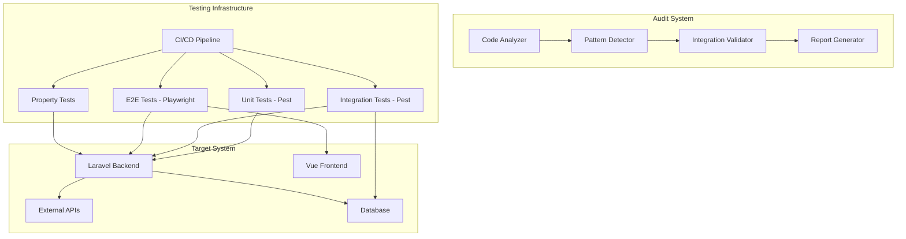

# Design Document: Platform Audit and Testing

## Overview

This design outlines a comprehensive approach to auditing, testing, and fixing the BizSocials platform. The system will systematically identify stub implementations, incomplete features, and missing integrations, then establish robust testing infrastructure and rectify all identified issues.

The audit process follows a three-phase approach:
1. **Discovery Phase**: Automated and manual code analysis to identify issues
2. **Testing Phase**: Establish comprehensive test coverage with unit, integration, E2E, and property-based tests
3. **Rectification Phase**: Fix identified issues with proper implementations

The design leverages existing infrastructure (Pest PHP, Playwright, PHPUnit) and adds property-based testing capabilities to ensure correctness across all feature areas.

## Architecture

### High-Level Architecture



### Audit System Components

The audit system consists of four main components:

1. **Code Analyzer**: Scans PHP and TypeScript/Vue files to identify patterns
2. **Pattern Detector**: Identifies stub implementations, hardcoded data, and missing logic
3. **Integration Validator**: Tests external API connections and OAuth flows
4. **Report Generator**: Creates structured reports with findings and recommendations

### Testing Infrastructure Layers

1. **Unit Tests (Pest PHP)**: Test individual service methods and business logic in isolation
2. **Integration Tests (Pest PHP)**: Test API endpoints with real database operations
3. **E2E Tests (Playwright)**: Test complete user workflows through the browser
4. **Property Tests**: Validate universal correctness properties across many inputs
5. **CI/CD Pipeline**: Automate all testing on commits, PRs, and deployments

## Components and Interfaces

### 1. Code Analyzer

**Purpose**: Scan codebase to identify potential issues

**Key Methods**:
```php
interface CodeAnalyzer
{
    // Scan a service class for stub patterns
    public function analyzeService(string $servicePath): ServiceAnalysisResult;
    
    // Scan an API endpoint for mock data returns
    public function analyzeEndpoint(string $routePath): EndpointAnalysisResult;
    
    // Scan a Vue component for hardcoded data
    public function analyzeComponent(string $componentPath): ComponentAnalysisResult;
    
    // Get all services in a feature area
    public function getFeatureServices(string $featureArea): array;
}
```

**Detection Patterns**:
- Methods returning hardcoded arrays or objects
- Comments containing "TODO", "STUB", "MOCK", "FAKE"
- Methods with no database queries but returning data
- API clients that don't make real HTTP requests
- Empty try-catch blocks or placeholder error handling

### 2. Pattern Detector

**Purpose**: Identify specific anti-patterns and stub implementations

**Key Methods**:
```php
interface PatternDetector
{
    // Detect if a method returns hardcoded data
    public function isHardcodedData(string $methodBody): bool;
    
    // Detect if database queries are present
    public function hasDatabaseOperations(string $methodBody): bool;
    
    // Detect if external API calls are made
    public function hasExternalApiCalls(string $methodBody): bool;
    
    // Detect if proper error handling exists
    public function hasProperErrorHandling(string $methodBody): bool;
    
    // Detect if validation is implemented
    public function hasValidation(string $methodBody): bool;
}
```

**Stub Patterns to Detect**:
```php
// Pattern 1: Hardcoded return values
public function getPosts() {
    return [
        ['id' => 1, 'title' => 'Sample Post'],
        ['id' => 2, 'title' => 'Another Post'],
    ];
}

// Pattern 2: Fake success responses
public function publishPost($postId) {
    return ['success' => true, 'message' => 'Published'];
}

// Pattern 3: No-op implementations
public function connectFacebook($token) {
    // TODO: Implement Facebook OAuth
    return true;
}

// Pattern 4: Mock API clients
public function getFacebookPosts() {
    // return $this->facebookClient->get('/posts'); // Real implementation
    return $this->getMockFacebookPosts(); // Stub
}
```

### 3. Integration Validator

**Purpose**: Test external integrations to verify they work

**Key Methods**:
```php
interface IntegrationValidator
{
    // Test OAuth flow for a social platform
    public function validateOAuthFlow(string $platform): ValidationResult;
    
    // Test API connection with real credentials
    public function validateApiConnection(string $platform): ValidationResult;
    
    // Test token storage and retrieval
    public function validateTokenManagement(string $platform): ValidationResult;
    
    // Test webhook handling
    public function validateWebhookHandling(string $platform): ValidationResult;
}
```

**Validation Approach**:
- Use test credentials to attempt real API calls
- Verify OAuth redirects and token exchanges work
- Check database for proper token storage
- Simulate webhook payloads and verify handling
- Test error scenarios (invalid tokens, rate limits)

### 4. Report Generator

**Purpose**: Create structured audit reports

**Report Structure**:
```typescript
interface AuditReport {
  featureArea: string;
  timestamp: Date;
  findings: Finding[];
  summary: {
    total: number;
    stubs: number;
    incomplete: number;
    missing: number;
    complete: number;
  };
  recommendations: Recommendation[];
}

interface Finding {
  id: string;
  type: 'stub' | 'incomplete' | 'missing' | 'complete';
  severity: 'critical' | 'high' | 'medium' | 'low';
  location: string; // File path and line number
  description: string;
  evidence: string; // Code snippet
  recommendation: string;
}
```

### 5. Test Infrastructure Components

#### Unit Test Structure (Pest PHP)

```php
// tests/Unit/Services/Social/FacebookServiceTest.php
describe('FacebookService', function () {
    beforeEach(function () {
        $this->service = app(FacebookService::class);
        $this->mockClient = Mockery::mock(FacebookClient::class);
        app()->instance(FacebookClient::class, $this->mockClient);
    });
    
    it('publishes post to Facebook', function () {
        $post = Post::factory()->create();
        $this->mockClient
            ->shouldReceive('publishPost')
            ->once()
            ->andReturn(['id' => 'fb_123']);
            
        $result = $this->service->publishPost($post);
        
        expect($result)->toHaveKey('id');
    });
    
    it('handles API errors gracefully', function () {
        $post = Post::factory()->create();
        $this->mockClient
            ->shouldReceive('publishPost')
            ->andThrow(new FacebookApiException('Rate limit exceeded'));
            
        expect(fn() => $this->service->publishPost($post))
            ->toThrow(FacebookApiException::class);
    });
});
```

#### Integration Test Structure (Pest PHP)

```php
// tests/Feature/Api/PostsTest.php
describe('Posts API', function () {
    beforeEach(function () {
        $this->user = User::factory()->create();
        $this->actingAs($this->user);
    });
    
    it('creates a post', function () {
        $data = [
            'content' => 'Test post content',
            'scheduled_at' => now()->addHour(),
            'platforms' => ['facebook', 'twitter'],
        ];
        
        $response = $this->postJson('/api/posts', $data);
        
        $response->assertStatus(201)
            ->assertJsonStructure(['data' => ['id', 'content', 'scheduled_at']]);
            
        $this->assertDatabaseHas('posts', [
            'content' => 'Test post content',
            'user_id' => $this->user->id,
        ]);
    });
    
    it('validates required fields', function () {
        $response = $this->postJson('/api/posts', []);
        
        $response->assertStatus(422)
            ->assertJsonValidationErrors(['content']);
    });
});
```

#### E2E Test Structure (Playwright)

```typescript
// frontend/e2e/tests/social/post-creation.spec.ts
import { test, expect } from '@playwright/test';
import { PostsPage } from '../pages/PostsPage';

test.describe('Post Creation Flow', () => {
  let postsPage: PostsPage;
  
  test.beforeEach(async ({ page }) => {
    postsPage = new PostsPage(page);
    await postsPage.goto();
  });
  
  test('creates and schedules a post', async ({ page }) => {
    await postsPage.clickCreatePost();
    await postsPage.fillContent('Test post from E2E');
    await postsPage.selectPlatforms(['Facebook', 'Twitter']);
    await postsPage.scheduleFor(new Date(Date.now() + 3600000));
    await postsPage.clickPublish();
    
    await expect(page.getByText('Post scheduled successfully')).toBeVisible();
    await expect(postsPage.getPostByContent('Test post from E2E')).toBeVisible();
  });
  
  test('validates empty content', async ({ page }) => {
    await postsPage.clickCreatePost();
    await postsPage.clickPublish();
    
    await expect(page.getByText('Content is required')).toBeVisible();
  });
});
```

#### Property Test Structure

```php
// tests/Unit/Properties/PostValidationTest.php
use function Pest\Faker\faker;

describe('Post Validation Properties', function () {
    it('rejects posts with only whitespace content', function () {
        // Property: For any string composed entirely of whitespace,
        // post validation should reject it
        
        $iterations = 100;
        for ($i = 0; $i < $iterations; $i++) {
            $whitespaceChars = [' ', "\t", "\n", "\r"];
            $length = rand(1, 50);
            $whitespaceString = '';
            
            for ($j = 0; $j < $length; $j++) {
                $whitespaceString .= $whitespaceChars[array_rand($whitespaceChars)];
            }
            
            $validator = validator(['content' => $whitespaceString], [
                'content' => 'required|string|min:1',
            ]);
            
            expect($validator->fails())->toBeTrue();
        }
    });
    
    it('preserves post count after scheduling', function () {
        // Property: For any valid post, scheduling it should increase
        // the scheduled posts count by exactly 1
        
        $iterations = 100;
        for ($i = 0; $i < $iterations; $i++) {
            $user = User::factory()->create();
            $initialCount = $user->posts()->scheduled()->count();
            
            $post = Post::factory()->create([
                'user_id' => $user->id,
                'status' => 'draft',
            ]);
            
            $post->schedule(now()->addHours(rand(1, 24)));
            
            $newCount = $user->posts()->scheduled()->count();
            
            expect($newCount)->toBe($initialCount + 1);
        }
    });
});
```

## Data Models

### Audit Report Models

```php
// app/Models/AuditReport.php
class AuditReport extends Model
{
    protected $fillable = [
        'feature_area',
        'findings',
        'summary',
        'recommendations',
        'status',
    ];
    
    protected $casts = [
        'findings' => 'array',
        'summary' => 'array',
        'recommendations' => 'array',
    ];
}

// app/Models/AuditFinding.php
class AuditFinding extends Model
{
    protected $fillable = [
        'audit_report_id',
        'type',
        'severity',
        'location',
        'description',
        'evidence',
        'recommendation',
        'status',
        'fixed_at',
    ];
    
    protected $casts = [
        'fixed_at' => 'datetime',
    ];
}
```

### Test Result Models

```php
// app/Models/TestRun.php
class TestRun extends Model
{
    protected $fillable = [
        'type', // unit, integration, e2e, property
        'status', // passed, failed, skipped
        'total_tests',
        'passed_tests',
        'failed_tests',
        'skipped_tests',
        'duration',
        'coverage_percentage',
        'failures',
    ];
    
    protected $casts = [
        'failures' => 'array',
        'duration' => 'float',
        'coverage_percentage' => 'float',
    ];
}
```

## Correctness Properties

*A property is a characteristic or behavior that should hold true across all valid executions of a system—essentially, a formal statement about what the system should do. Properties serve as the bridge between human-readable specifications and machine-verifiable correctness guarantees.*


### Property 1: Complete File Discovery

*For any* directory containing code files (services, endpoints, components), the Code Analyzer should discover and return all files in that directory and its subdirectories.

**Validates: Requirements 1.1, 1.2, 1.3**

### Property 2: Hardcoded Data Detection

*For any* method or function that returns hardcoded arrays, objects, or literal values without database queries or API calls, the Pattern Detector should identify it as returning mock data.

**Validates: Requirements 1.4, 1.5, 2.9, 3.3, 5.4**

### Property 3: Finding Categorization

*For any* audit finding, it should be assigned exactly one category from the set {stub, incomplete, missing, complete}, and the categorization should be consistent across multiple analyses of the same code.

**Validates: Requirements 1.7**

### Property 4: Report Structure Completeness

*For any* audit run, the generated report should contain all required fields (feature_area, timestamp, findings array, summary object, recommendations array) and the summary counts should match the actual findings.

**Validates: Requirements 1.6, 21.1, 21.2, 21.6**

### Property 5: Token Security Verification

*For any* social media platform integration, if tokens are stored in the database, they should be encrypted and not stored in plain text.

**Validates: Requirements 2.7**

### Property 6: Token Refresh Implementation

*For any* social platform that requires OAuth token refresh (Facebook, Instagram, LinkedIn), a token refresh mechanism should exist and be callable.

**Validates: Requirements 2.8**

### Property 7: Database Persistence Verification

*For any* create, update, or delete operation on domain entities (posts, messages, tickets, articles, workflows, subscriptions), the operation should result in corresponding changes in the database that can be queried and verified.

**Validates: Requirements 3.1, 4.3, 4.6, 6.1, 6.2, 6.5, 7.5, 8.1, 8.2, 8.3, 9.1, 9.3, 10.1, 10.3**

### Property 8: Queue Job Creation

*For any* post scheduled for future publication, a corresponding Laravel queue job should be created with the correct scheduled time and post identifier.

**Validates: Requirements 3.2**

### Property 9: Real API Call Verification

*For any* operation that interacts with external services (social platforms, payment gateways, WhatsApp), the audit system should verify that real HTTP requests are made to the external API endpoints, not mocked or stubbed responses.

**Validates: Requirements 3.4, 4.1, 4.2, 5.2, 7.2, 10.2**

### Property 10: Storage Verification

*For any* media file upload operation, the file should exist in the configured storage system (local filesystem or S3) and be retrievable using the stored path.

**Validates: Requirements 3.5**

### Property 11: Status Tracking Consistency

*For any* entity with status transitions (posts: draft→scheduled→published→failed, tickets: open→assigned→resolved), status changes should be immediately reflected in the database and queryable.

**Validates: Requirements 3.6**

### Property 12: Bulk Operation Authenticity

*For any* bulk operation (bulk post creation, bulk deletion, bulk status updates), the operation should process actual database records and the number of affected records should match the operation's return value.

**Validates: Requirements 3.7**

### Property 13: Database Query Verification

*For any* filtering, searching, or aggregation operation (message filters, analytics calculations, ticket search, usage tracking), the operation should execute actual database queries and return results that match the current database state.

**Validates: Requirements 4.5, 5.1, 5.6, 8.5, 10.6**

### Property 14: Notification Delivery

*For any* event that should trigger notifications (pending approvals, new tickets, real-time messages), a notification should be created and delivered through the configured notification system.

**Validates: Requirements 6.3**

### Property 15: Workflow Definition Persistence

*For any* workflow created through the workflow builder UI, a corresponding workflow definition should be persisted to the database with all steps, conditions, and actions intact.

**Validates: Requirements 6.4**

### Property 16: Template Synchronization

*For any* WhatsApp message template, it should exist in both the local database and the WhatsApp Business API, and the content should match.

**Validates: Requirements 7.4**

### Property 17: Article Versioning

*For any* article update operation, a new version record should be created in the database preserving the previous content, and the version history should be queryable.

**Validates: Requirements 9.4**

### Property 18: Search Functionality

*For any* search operation on articles, the search should use the configured search engine (Meilisearch or database full-text search) and return results that match the search query.

**Validates: Requirements 9.2**

### Property 19: Public Content Consistency

*For any* publicly accessible knowledge base article, the displayed content should exactly match the published version in the database.

**Validates: Requirements 9.5**

### Property 20: Invoice Generation

*For any* completed payment transaction, an invoice PDF should be generated, stored in the filesystem, and associated with the transaction in the database.

**Validates: Requirements 10.4**

### Property 21: Webhook Processing

*For any* valid webhook payload from Razorpay, the webhook handler should process it, update the relevant subscription status in the database, and return a success response.

**Validates: Requirements 10.5**

### Property 22: Test Coverage Completeness

*For any* Backend Service class, unit tests should exist that cover all public methods, and for any API endpoint, integration tests should exist that test all HTTP methods and response codes.

**Validates: Requirements 12.1, 13.1**

### Property 23: Rectification Task Creation

*For any* audit finding categorized as "stub" or "incomplete", a corresponding rectification task should be created with a clear description, location, and recommendation.

**Validates: Requirements 16.1**

### Property 24: Input Validation Universality

*For any* API endpoint that accepts user input, validation rules should be defined and enforced, and invalid inputs should be rejected with appropriate error messages.

**Validates: Requirements 18.1**

## Error Handling

### Audit System Error Handling

1. **File Access Errors**: If a file cannot be read, log the error and continue with other files
2. **Parse Errors**: If code cannot be parsed, mark the file for manual review
3. **API Connection Errors**: If external APIs cannot be reached during validation, mark as "unable to verify"
4. **Database Errors**: If database queries fail during audit, log and continue

### Testing Infrastructure Error Handling

1. **Test Failures**: Capture full stack traces and context for debugging
2. **Timeout Handling**: Set reasonable timeouts for all tests (unit: 5s, integration: 30s, E2E: 60s)
3. **Flaky Test Detection**: Track test failure rates and flag consistently flaky tests
4. **Resource Cleanup**: Ensure database transactions are rolled back and test data is cleaned up

### Rectification Error Handling

1. **Migration Failures**: Rollback database changes if migrations fail
2. **API Integration Errors**: Implement retry logic with exponential backoff
3. **Validation Errors**: Provide clear, actionable error messages
4. **Transaction Management**: Wrap critical operations in database transactions

## Testing Strategy

### Dual Testing Approach

The testing strategy employs both unit tests and property-based tests as complementary approaches:

- **Unit Tests**: Verify specific examples, edge cases, and error conditions
- **Property Tests**: Verify universal properties across all inputs through randomization
- Both are necessary for comprehensive coverage

### Unit Testing Balance

Unit tests should focus on:
- Specific examples that demonstrate correct behavior
- Integration points between components
- Edge cases and error conditions (empty inputs, boundary values, invalid data)
- Error handling paths

Property tests should focus on:
- Universal properties that hold for all inputs
- Comprehensive input coverage through randomization
- Invariants that must be preserved
- Round-trip properties (serialize/deserialize, encode/decode)

Avoid writing too many unit tests for scenarios that property tests can cover through randomization.

### Property-Based Testing Configuration

- **Library**: Use a PHP property-based testing library or implement generators with Pest
- **Iterations**: Minimum 100 iterations per property test
- **Tagging**: Each property test must reference its design document property
- **Tag Format**: `// Feature: platform-audit-and-testing, Property {number}: {property_text}`
- **Mapping**: Each correctness property must be implemented by a single property-based test

### Test Organization

```
backend/tests/
├── Unit/
│   ├── Services/
│   │   ├── Social/
│   │   │   ├── FacebookServiceTest.php
│   │   │   ├── InstagramServiceTest.php
│   │   │   └── ...
│   │   ├── Analytics/
│   │   ├── Billing/
│   │   └── ...
│   ├── Audit/
│   │   ├── CodeAnalyzerTest.php
│   │   ├── PatternDetectorTest.php
│   │   └── IntegrationValidatorTest.php
│   └── Properties/
│       ├── DatabasePersistenceTest.php
│       ├── ApiCallVerificationTest.php
│       └── ValidationTest.php
├── Feature/
│   ├── Api/
│   │   ├── PostsTest.php
│   │   ├── InboxTest.php
│   │   ├── AnalyticsTest.php
│   │   └── ...
│   ├── Audit/
│   │   ├── SocialIntegrationAuditTest.php
│   │   ├── ContentManagementAuditTest.php
│   │   └── ...
│   └── Integration/
│       ├── FacebookIntegrationTest.php
│       ├── RazorpayIntegrationTest.php
│       └── ...
└── Stubs/
    ├── MockFacebookClient.php
    ├── MockRazorpayClient.php
    └── ...

frontend/e2e/tests/
├── auth/
│   ├── login.spec.ts
│   ├── register.spec.ts
│   └── ...
├── social/
│   ├── post-creation.spec.ts
│   ├── account-connection.spec.ts
│   └── scheduling.spec.ts
├── inbox/
│   ├── message-handling.spec.ts
│   └── reply-flow.spec.ts
├── analytics/
│   ├── dashboard.spec.ts
│   └── reports.spec.ts
├── billing/
│   ├── subscription.spec.ts
│   └── payment.spec.ts
└── workflow/
    ├── approval-flow.spec.ts
    └── workflow-builder.spec.ts
```

### CI/CD Integration

```yaml
# .github/workflows/test.yml
name: Test Suite

on: [push, pull_request]

jobs:
  unit-tests:
    runs-on: ubuntu-latest
    steps:
      - uses: actions/checkout@v3
      - name: Setup PHP
        uses: shivammathur/setup-php@v2
        with:
          php-version: '8.2'
      - name: Install dependencies
        run: composer install
      - name: Run unit tests
        run: php artisan test --testsuite=Unit --coverage
      
  integration-tests:
    runs-on: ubuntu-latest
    services:
      mysql:
        image: mysql:8.0
        env:
          MYSQL_DATABASE: testing
          MYSQL_ROOT_PASSWORD: password
    steps:
      - uses: actions/checkout@v3
      - name: Setup PHP
        uses: shivammathur/setup-php@v2
        with:
          php-version: '8.2'
      - name: Install dependencies
        run: composer install
      - name: Run integration tests
        run: php artisan test --testsuite=Feature
  
  e2e-tests:
    runs-on: ubuntu-latest
    steps:
      - uses: actions/checkout@v3
      - name: Setup Node
        uses: actions/setup-node@v3
        with:
          node-version: '20'
      - name: Install dependencies
        run: |
          cd frontend
          npm ci
      - name: Install Playwright
        run: cd frontend && npx playwright install --with-deps
      - name: Run E2E tests
        run: cd frontend && npm run test:e2e
      - name: Upload test results
        if: always()
        uses: actions/upload-artifact@v3
        with:
          name: playwright-report
          path: frontend/playwright-report/
  
  static-analysis:
    runs-on: ubuntu-latest
    steps:
      - uses: actions/checkout@v3
      - name: Setup PHP
        uses: shivammathur/setup-php@v2
        with:
          php-version: '8.2'
      - name: Install dependencies
        run: composer install
      - name: Run PHPStan
        run: ./vendor/bin/phpstan analyse
```

### Test Data Management

1. **Factories**: Use Laravel factories for all models
2. **Seeders**: Create seeders for common test scenarios
3. **Test Database**: Use SQLite in-memory database for fast tests
4. **Cleanup**: Use `RefreshDatabase` trait to ensure clean state
5. **Fixtures**: Store complex test data as JSON fixtures

### Performance Testing Strategy

1. **Load Testing**: Use tools like Apache JMeter or k6 for API load tests
2. **Database Performance**: Use Laravel Telescope to identify slow queries
3. **Frontend Performance**: Use Lighthouse CI for performance budgets
4. **Benchmarking**: Establish baseline performance metrics for critical paths

### Manual Testing Checklists

For features that cannot be fully automated, maintain manual testing checklists:

1. **Social Media Connections**: Verify OAuth flows in real browsers with real accounts
2. **Payment Processing**: Test with Razorpay test mode and verify webhooks
3. **WhatsApp Integration**: Test with WhatsApp Business API sandbox
4. **Email Notifications**: Verify email templates and delivery
5. **UI/UX**: Verify responsive design and accessibility

## Implementation Phases

### Phase 1: Audit Infrastructure (Week 1-2)

1. Implement Code Analyzer with file scanning capabilities
2. Implement Pattern Detector with stub detection patterns
3. Create audit report data models and storage
4. Build basic CLI command for running audits

### Phase 2: Feature Area Audits (Week 3-4)

1. Audit social media integrations (Facebook, Instagram, Twitter, LinkedIn)
2. Audit content management (posts, scheduling, calendar)
3. Audit unified inbox and messaging
4. Audit analytics and reporting
5. Generate comprehensive audit reports

### Phase 3: Testing Infrastructure (Week 5-6)

1. Set up property-based testing framework
2. Create test factories for all models
3. Configure CI/CD pipelines
4. Write base test classes and helpers
5. Set up E2E test infrastructure

### Phase 4: Test Implementation (Week 7-10)

1. Write unit tests for all services (parallel work)
2. Write integration tests for all API endpoints (parallel work)
3. Write E2E tests for critical user flows
4. Write property-based tests for correctness properties
5. Achieve 80%+ code coverage

### Phase 5: Rectification (Week 11-14)

1. Fix stub implementations identified in audits
2. Complete missing integrations
3. Implement proper error handling
4. Add comprehensive validation
5. Security hardening

### Phase 6: Validation and Documentation (Week 15-16)

1. Run full test suite and fix failures
2. Perform manual testing of critical flows
3. Generate final audit reports
4. Document all changes and improvements
5. Create runbooks for maintaining test suite

## Success Metrics

1. **Audit Coverage**: 100% of feature areas audited
2. **Test Coverage**: 80%+ code coverage for backend, 70%+ for frontend
3. **Stub Elimination**: 0 stub implementations remaining
4. **Integration Completeness**: All external integrations functional
5. **CI/CD Success Rate**: 95%+ green builds
6. **Performance**: All API endpoints respond within 500ms under normal load
7. **Security**: 0 critical or high severity security issues
